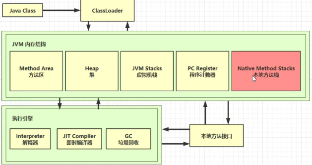

## 内存结构

### 1. 程序计数器


#### 1.1 定义

Program Counter Register 程序计数器（物理上是用寄存器实现）

- 作用：是记住下一条jvm指令的执行地址
- 特点
  - 是线程私有的
  - 不会存在内存溢出

#### 1.2 作用

```
0: getstatic #20 		// PrintStream out = System.out;
3: astore_1 			// --
4: aload_1 				// out.println(1);
5: iconst_1 			// --
6: invokevirtual #26 	 // --
9: aload_1 				// out.println(2);
10: iconst_2 			// --
11: invokevirtual #26 	 // --
14: aload_1 			// out.println(3);
15: iconst_3 			// --
16: invokevirtual #26 	 // --
19: aload_1 			// out.println(4);
20: iconst_4 			// --
21: invokevirtual #26 	 // --
24: aload_1 			// out.println(5);
25: iconst_5 			// --
26: invokevirtual #26 	 // --
29: return
```


### 2. 虚拟机栈


#### 2.1 定义

Java Virtual Machine Stacks （Java 虚拟机栈）

- 栈：线程运行需要的内存空间
- 栈帧：每个方法运行时需要的内存，内容有参数、局部变量、返回地址
- 每个线程只能有一个活动栈帧，对应着栈顶部当前正在执行的那个方法

问题辨析

1. 垃圾回收是否涉及栈内存？

   不需要，栈帧内存在方法结束时会出栈即直接回释放该栈帧内存

2. 栈内存分配越大越好吗？

   划分的太大只是能够进行更深的方法调用，对性能并没有提升，反而会影响线程数

3. 方法内的局部变量是否线程安全？
   - 如果方法内局部变量没有逃离方法的作用访问，它是线程安全的
   - 如果是局部变量引用了对象，并逃离方法的作用范围，需要考虑线程安全

#### 2.2 栈内存溢出

- 栈帧过多导致栈内存溢出
- 栈帧过大导致栈内存溢出

#### 2.3 线程运行诊断

##### 案例1：cpu占用过多

定位

- 用top定位哪个进程对cpu的占用过高
- ps H -eo pid,tid,%cpu | grep 进程id （用ps命令进一步定位是哪个线程引起的cpu占用过高）
- jstack 进程id
  - 可以根据线程id 找到有问题的线程，进一步定位到问题代码的源码行号

##### 案例2：程序运行很长时间没有结果（死锁等情况）


### 3. 本地方法栈




### 4. 堆


#### 4.1 定义

Heap 堆

- 通过 new 关键字创建对象都会使用堆内存

特点

- 它是线程共享的，堆中对象都需要考虑线程安全的问题
- 有垃圾回收机制

#### 4.2 堆内存溢出

#### 4.3 堆内存诊断

1. jps 工具
   - 查看当前系统中有哪些 java 进程
2. jmap 工具
   - 查看堆内存占用情况 jmap - heap 进程id
3.  jconsole 工具
   - 图形界面的，多功能的监测工具，可以连续监测

案例

- 垃圾回收后，内存占用仍然很高


### 5. 方法区


#### 5.1 定义

[JVM规范-方法区定义](https://docs.oracle.com/javase/specs/jvms/se8/html/jvms-2.html)

Java 虚拟机在所有线程之间共享*的方法区域*。方法区域类似于传统语言编译代码的存储区域，或类似于操作系统过程中的"文本"段。它存储类结构，如运行时常数池、字段和方法数据，以及方法和构造器的代码，包括类和实例初始化和接口初始化中使用的特殊方法。

方法区在虚拟机启动时被创建。虽然方法区域在逻辑上是堆的一部分，但简单的实现可能会选择不收集垃圾或压缩垃圾。此规范不要求方法区域的位置或用于管理编译代码的策略。方法区域可能是固定大小的，也可以根据计算的要求进行扩展，如果更大的方法区域变得没有必要，则可以收缩。方法区域的内存不需要连续。

Java 虚拟机实现可以为程序员或用户提供对方法区域初始大小的控制，以及在不同大小的方法区域的情况下，对最大和最小方法区域大小的控制。

下列特殊情况与方法区域相关联：

- 如果无法提供方法区域中的内存以满足分配请求，Java 虚拟机会抛出一个 。`OutOfMemoryError`

#### 5.2 组成


#### 5.3 方法区内存溢出

- 1.8 以前会导致永久代内存溢出 

  `-XX:MaxPermSize=8m`

- 1.8 之后会导致元空间内存溢出

  `演示元空间内存溢出 java.lang.OutOfMemoryError: Metaspace`

  ` -XX:MaxMetaspaceSize=8m`

#### 5.4 运行时常量池

- 常量池，就是一张表，虚拟机指令根据这张常量表找到要执行的类名、方法名、参数类型、字面量等信息
- 运行时常量池，常量池是 *.class 文件中的，当该类被加载，它的常量池信息就会放入运行时常量池，并把里面的符号地址变为真实地址

#### 5.5 StringTable(串池)

```java
// 常量池中的信息，都会被加载到运行时常量池中，这时 a  b  ab 都是常量池中的符号，还没有变为java中的字符串对象
// 只有当执行到具体的代码上，如ldc #2 会把 a 符号变为"a"字符串对象，此时会以"a"为key到SringTable（哈希表实现，不能扩容）中找是否有，没有就将该对象放入，已经有了就直接使用
String s1 = "a";
String s2 = "b";
// 串池中
String s3 = "a" + "b";
// 通过StringBuilder来构建，最后toString会new一个String
String s4 = s1 + s2;
// 串池中
String s5 = "ab";
String s6 = s4.intern();

System.out.println(s3 == s4); // false
System.out.println(s3 == s5); // ture
System.out.println(s3 == s6); // true
// 堆中的new String("cd")
String x2 = new String("c") + new String("d");
// 串池中
String x1 = "cd";
x2.intern();
// 如果调换了【最后两行代码】的位置则为true，如果是jdk1.6还是false
System.out.println(x1 == x2); // false
```

#### 5.5  StringTable 特性

- 常量池中的字符串仅是符号，第一次用到时才变为对象
- 利用串池的机制，来避免重复创建字符串对象
- 字符串变量拼接的原理是 StringBuilder （1.8）
- 字符串常量拼接的原理是编译期优化
- 可以使用 intern 方法，主动将串池中还没有的字符串对象放入串池
  - 1.8 将这个字符串对象尝试放入串池，如果有则并不会放入，如果没有则放入串池， 会把串池中的对象返回
  - 1.6 将这个字符串对象尝试放入串池，如果有则并不会放入，如果没有会把此对象复制一份， 放入串池， 会把串池中的对象返回

#### 5.6 StringTable 位置

jdk6串池在常量池中 ，因为永久代要full gc才会触发串池的垃圾回收因此字符串会长期占用内存空间，因此jdk8优化后将串池放到了堆中，堆中只要minor gc就会触发串池的垃圾回收

#### 5.7 StringTable 性能调优

- 调整 `-XX:StringTableSize=桶个数`，最小值为1099，默认为60013，来影响哈希表的碰撞发生
- 考虑是否将字符串对象入池，不入池重复的字符串也会占用对空间，入池则重复字符串只保存一份

### 6. 直接内存

#### 6.1 定义

Direct Memory

- 常见于 NIO 操作时，用于数据缓冲区
- 分配回收成本较高，但读写性能高
- 不受 JVM 内存回收管理


#### 6.2 分配和回收原理

- 使用了 Unsafe 对象完成直接内存的分配回收，并且回收需要主动调用 freeMemory 方法
- ByteBuffer 的实现类内部，使用了 Cleaner （虚引用）来监测 ByteBuffer 对象，一旦 ByteBuffer 对象被垃圾回收，那么就会由 ReferenceHandler 线程通过 Cleaner 的 clean 方法调 用 freeMemory 来释放直接内存