## 类加载与字节码技术

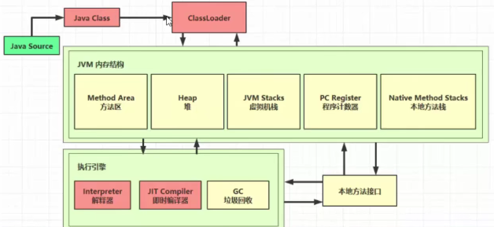

### 1. 类文件结构

一个简单的 HelloWorld.java

```java
// HelloWorld 示例
public class HelloWorld {
    public static void main(String[] args) {
        System.out.println("hello world");
    }
}
```

执行 `javac -parameters -d . HellowWorld.java`

编译为 HelloWorld.class 后是这个样子的：

```
[root@localhost ~]# od -t xC HelloWorld.class
0000000 ca fe ba be 00 00 00 34 00 23 0a 00 06 00 15 09
0000020 00 16 00 17 08 00 18 0a 00 19 00 1a 07 00 1b 07
0000040 00 1c 01 00 06 3c 69 6e 69 74 3e 01 00 03 28 29
0000060 56 01 00 04 43 6f 64 65 01 00 0f 4c 69 6e 65 4e
0000100 75 6d 62 65 72 54 61 62 6c 65 01 00 12 4c 6f 63
0000120 61 6c 56 61 72 69 61 62 6c 65 54 61 62 6c 65 01
0000140 00 04 74 68 69 73 01 00 1d 4c 63 6e 2f 69 74 63
0000160 61 73 74 2f 6a 76 6d 2f 74 35 2f 48 65 6c 6c 6f
0000200 57 6f 72 6c 64 3b 01 00 04 6d 61 69 6e 01 00 16
0000220 28 5b 4c 6a 61 76 61 2f 6c 61 6e 67 2f 53 74 72
0000240 69 6e 67 3b 29 56 01 00 04 61 72 67 73 01 00 13
0000260 5b 4c 6a 61 76 61 2f 6c 61 6e 67 2f 53 74 72 69
0000300 6e 67 3b 01 00 10 4d 65 74 68 6f 64 50 61 72 61
0000320 6d 65 74 65 72 73 01 00 0a 53 6f 75 72 63 65 46
0000340 69 6c 65 01 00 0f 48 65 6c 6c 6f 57 6f 72 6c 64
0000360 2e 6a 61 76 61 0c 00 07 00 08 07 00 1d 0c 00 1e
0000400 00 1f 01 00 0b 68 65 6c 6c 6f 20 77 6f 72 6c 64
0000420 07 00 20 0c 00 21 00 22 01 00 1b 63 6e 2f 69 74
0000440 63 61 73 74 2f 6a 76 6d 2f 74 35 2f 48 65 6c 6c
0000460 6f 57 6f 72 6c 64 01 00 10 6a 61 76 61 2f 6c 61
0000500 6e 67 2f 4f 62 6a 65 63 74 01 00 10 6a 61 76 61
0000520 2f 6c 61 6e 67 2f 53 79 73 74 65 6d 01 00 03 6f
0000540 75 74 01 00 15 4c 6a 61 76 61 2f 69 6f 2f 50 72
0000560 69 6e 74 53 74 72 65 61 6d 3b 01 00 13 6a 61 76
0000600 61 2f 69 6f 2f 50 72 69 6e 74 53 74 72 65 61 6d
0000620 01 00 07 70 72 69 6e 74 6c 6e 01 00 15 28 4c 6a
0000640 61 76 61 2f 6c 61 6e 67 2f 53 74 72 69 6e 67 3b
0000660 29 56 00 21 00 05 00 06 00 00 00 00 00 02 00 01
0000700 00 07 00 08 00 01 00 09 00 00 00 2f 00 01 00 01
0000720 00 00 00 05 2a b7 00 01 b1 00 00 00 02 00 0a 00
0000740 00 00 06 00 01 00 00 00 04 00 0b 00 00 00 0c 00
0000760 01 00 00 00 05 00 0c 00 0d 00 00 00 09 00 0e 00
0001000 0f 00 02 00 09 00 00 00 37 00 02 00 01 00 00 00
0001020 09 b2 00 02 12 03 b6 00 04 b1 00 00 00 02 00 0a
0001040 00 00 00 0a 00 02 00 00 00 06 00 08 00 07 00 0b
0001060 00 00 00 0c 00 01 00 00 00 09 00 10 00 11 00 00
0001100 00 12 00 00 00 05 01 00 10 00 00 00 01 00 13 00
0001120 00 00 02 00 14
```

根据 JVM 规范，类文件结构如下

```
ClassFile {
u4 magic;  //魔数
u2 minor_version;  // 小版本号
u2 major_version;  // 主版本号
u2 constant_pool_count;  // 常量池信息
cp_info constant_pool[constant_pool_count-1];  // 常量池信息
u2 access_flags;  // 访问修饰符
u2 this_class;    // 自身类信息
u2 super_class;   // 父类信息
u2 interfaces_count;   // 接口信息
u2 interfaces[interfaces_count];   // 接口信息
u2 fields_count;   // 变量信息
field_info fields[fields_count];  // 变量信息
u2 methods_count;  // 方法信息
method_info methods[methods_count];  // 方法信息
u2 attributes_count;   // 类的附加属性信息
attribute_info attributes[attributes_count];   // 类的附加属性信息
}
```

#### 1.1  魔数

0~3 字节，表示它是否是【class】类型的文件

0000000 <span style="color: red">ca fe ba be</span> 00 00 00 34 00 23 0a 00 06 00 15 09

#### 1.2 版本

4~7 字节，表示类的版本 00 34（52） 表示是 Java 8

0000000 ca fe ba be <span style="color: red">00 00 00 34</span> 00 23 0a 00 06 00 15 09

#### 1.3 常量池

| Constant Type               | Value |
| --------------------------- | ----- |
| CONSTANT_Class              | 7     |
| CONSTANT_Fieldref           | 9     |
| CONSTANT_Methodref          | 10    |
| CONSTANT_InterfaceMethodref | 11    |
| CONSTANT_String             | 8     |
| CONSTANT_Integer            | 3     |
| CONSTANT_Float              | 4     |
| CONSTANT_Long               | 5     |
| CONSTANT_Double             | 6     |
| CONSTANT_NameAndType        | 12    |
| CONSTANT_Utf8               | 1     |
| CONSTANT_MethodHandle       | 15    |
| CONSTANT_MethodType         | 16    |
| CONSTANT_InvokeDynamic      | 18    |

8~9 字节，表示常量池长度，00 23 （35） 表示常量池有 #1~#34项，注意 #0 项不计入，也没有值

0000000 ca fe ba be 00 00 00 34 <span style="color: red">00 23</span> 0a 00 06 00 15 09

第#1项 0a 表示一个 Method 信息，00 06 和 00 15（21） 表示它引用了常量池中 #6 和 #21 项来获得 这个方法的【所属类】和【方法名】

0000000 ca fe ba be 00 00 00 34 00 23 <span style="color: red">0a 00 06 00 15</span> 09

第#2项 09 表示一个 Field 信息，00 16（22）和 00 17（23） 表示它引用了常量池中 #22 和 # 23 项 来获得这个成员变量的【所属类】和【成员变量名】

0000000 ca fe ba be 00 00 00 34 00 23 0a 00 06 00 15 <span style="color: red">09</span>

0000020 <span style="color: red">00 16 00 17</span> 08 00 18 0a 00 19 00 1a 07 00 1b 07


第#3项 08 表示一个字符串常量名称，00 18（24）表示它引用了常量池中 #24 项

0000020 00 16 00 17 <span style="color: red">08 00 18</span> 0a 00 19 00 1a 07 00 1b 07


第#4项 0a 表示一个 Method 信息，00 19（25） 和 00 1a（26） 表示它引用了常量池中 #25 和 #26 项来获得这个方法的【所属类】和【方法名】

0000020 00 16 00 17 08 00 18 <span style="color: red">0a 00 19 00 1a</span> 07 00 1b 07


第#5项 07 表示一个 Class 信息，00 1b（27） 表示它引用了常量池中 #27 项

0000020 00 16 00 17 08 00 18 0a 00 19 00 1a <span style="color: red">07 00 1b</span> 07 


第#6项 07 表示一个 Class 信息，00 1c（28） 表示它引用了常量池中 #28 项 

0000020 00 16 00 17 08 00 18 0a 00 19 00 1a 07 00 1b <span style="color: red">07</span> 

0000040 <span style="color: red">00 1c</span> 01 00 06 3c 69 6e 69 74 3e 01 00 03 28 29 


第#7项 01 表示一个 utf8 串，00 06 表示长度，3c 69 6e 69 74 3e 是【 `<init>` 】 

0000040 00 1c <span style="color: red">01 00 06 3c 69 6e 69 74 3e</span> 01 00 03 28 29 


第#8项 01 表示一个 utf8 串，00 03 表示长度，28 29 56 是【()V】其实就是表示无参、无返回值 

0000040 00 1c 01 00 06 3c 69 6e 69 74 3e <span style="color: red">01 00 03 28 29</span> 

0000060 <span style="color: red">56</span> 01 00 04 43 6f 64 65 01 00 0f 4c 69 6e 65 4e 


第#9项 01 表示一个 utf8 串，00 04 表示长度，43 6f 64 65 是【Code】 

0000060 56 <span style="color: red">01 00 04 43 6f 64 65</span> 01 00 0f 4c 69 6e 65 4e 


第#10项 01 表示一个 utf8 串，00 0f（15） 表示长度，4c 69 6e 65 4e 75 6d 62 65 72 54 61 62 6c 65 是【LineNumberTable】 

0000060 56 01 00 04 43 6f 64 65 <span style="color: red">01 00 0f 4c 69 6e 65 4e</span> 

0000100 <span style="color: red">75 6d 62 65 72 54 61 62 6c 65</span> 01 00 12 4c 6f 63 


第#11项 01 表示一个 utf8 串，00 12（18） 表示长度，4c 6f 63 61 6c 56 61 72 69 61 62 6c 65 54 61 62 6c 65是【LocalVariableTable】 

0000100 75 6d 62 65 72 54 61 62 6c 65 <span style="color: red">01 00 12 4c 6f 63</span>

0000120 <span style="color: red">61 6c 56 61 72 69 61 62 6c 65 54 61 62 6c 65</span> 01 


第#12项 01 表示一个 utf8 串，00 04 表示长度，74 68 69 73 是【this】 

0000120 61 6c 56 61 72 69 61 62 6c 65 54 61 62 6c 65 <span style="color: red">01</span> 

0000140 <span style="color: red">00 04 74 68 69 73</span> 01 00 1d 4c 63 6e 2f 69 74 63 


第#13项 01 表示一个 utf8 串，00 1d（29） 表示长度，是【Lcn/itcast/jvm/t5/HelloWorld;】

0000140 00 04 74 68 69 73 <span style="color: red">01 00 1d 4c 63 6e 2f 69 74 63</span>

0000160 <span style="color: red">61 73 74 2f 6a 76 6d 2f 74 35 2f 48 65 6c 6c 6f</span>


第#14项 01 表示一个 utf8 串，00 04 表示长度，74 68 69 73 是【main】 

0000200 57 6f 72 6c 64 3b <span style="color: red">01 00 04 6d 61 69 6e</span> 01 00 16 


第#15项 01 表示一个 utf8 串，00 16（22） 表示长度，是【([Ljava/lang/String;)V】其实就是参数为 字符串数组，无返回值 

0000200 57 6f 72 6c 64 3b 01 00 04 6d 61 69 6e <span style="color: red">01 00 16</span> 

0000220 <span style="color: red">28 5b 4c 6a 61 76 61 2f 6c 61 6e 67 2f 53 74 72</span> 

0000240 <span style="color: red">69 6e 67 3b 29 56</span> 01 00 04 61 72 67 73 01 00 13 


第#16项 01 表示一个 utf8 串，00 04 表示长度，是【args】 

0000240 69 6e 67 3b 29 56 <span style="color: red">01 00 04 61 72 67 73</span> 01 00 13 


第#17项 01 表示一个 utf8 串，00 13（19） 表示长度，是【[Ljava/lang/String;】 

0000240 69 6e 67 3b 29 56 01 00 04 61 72 67 73 <span style="color: red">01 00 13</span>

0000260 5b 4c 6a 61 76 61 2f 6c 61 6e 67 2f 53 74 72 69 

0000300 <span style="color: red">6e 67 3b</span> 01 00 10 4d 65 74 68 6f 64 50 61 72 61 


第#18项 01 表示一个 utf8 串，00 10（16） 表示长度，是【MethodParameters】 

0000300 6e 67 3b <span style="color: red">01 00 10 4d 65 74 68 6f 64 50 61 72 61</span>

0000320 <span style="color: red">6d 65 74 65 72 73</span> 01 00 0a 53 6f 75 72 63 65 46 


第#19项 01 表示一个 utf8 串，00 0a（10） 表示长度，是【SourceFile】 

0000320 6d 65 74 65 72 73 <span style="color: red">01 00 0a 53 6f 75 72 63 65 46</span> 

0000340 <span style="color: red">69 6c 65</span> 01 00 0f 48 65 6c 6c 6f 57 6f 72 6c 64 


第#20项 01 表示一个 utf8 串，00 0f（15） 表示长度，是【HelloWorld.java】 

0000340 69 6c 65 <span style="color: red">01 00 0f 48 65 6c 6c 6f 57 6f 72 6c 64</span> 

0000360 <span style="color: red">2e 6a 61 76 61</span> 0c 00 07 00 08 07 00 1d 0c 00 1e 


第#21项 0c 表示一个 【名+类型】，00 07 00 08 引用了常量池中 #7 #8 两项 

0000360 2e 6a 61 76 61 <span style="color: red">0c 00 07 00 08</span> 07 00 1d 0c 00 1e 


第#22项 07 表示一个 Class 信息，00 1d（29） 引用了常量池中 #29 项 

0000360 2e 6a 61 76 61 0c 00 07 00 08 <span style="color: red">07 00 1d</span> 0c 00 1e


第#23项 0c 表示一个 【名+类型】，00 1e（30） 00 1f （31）引用了常量池中 #30 #31 两项 

0000360 2e 6a 61 76 61 0c 00 07 00 08 07 00 1d <span style="color: red">0c 00 1e</span> 

0000400 <span style="color: red">00 1f</span> 01 00 0b 68 65 6c 6c 6f 20 77 6f 72 6c 64 


第#24项 01 表示一个 utf8 串，00 0f（15） 表示长度，是【hello world】 

0000400 00 1f <span style="color: red">01 00 0b 68 65 6c 6c 6f 20 77 6f 72 6c 64</span>


第#25项 07 表示一个 Class 信息，00 20（32） 引用了常量池中 #32 项 

0000420 <span style="color: red">07 00 20</span> 0c 00 21 00 22 01 00 1b 63 6e 2f 69 74 


第#26项 0c 表示一个 【名+类型】，00 21（33） 00 22（34）引用了常量池中 #33 #34 两项 

0000420 07 00 20 <span style="color: red">0c 00 21 00 22</span> 01 00 1b 63 6e 2f 69 74 


第#27项 01 表示一个 utf8 串，00 1b（27） 表示长度，是【cn/itcast/jvm/t5/HelloWorld】 

0000420 07 00 20 0c 00 21 00 22 <span style="color: red">01 00 1b 63 6e 2f 69 74</span>

0000440 <span style="color: red">63 61 73 74 2f 6a 76 6d 2f 74 35 2f 48 65 6c 6c</span> 

0000460 <span style="color: red">6f 57 6f 72 6c 64</span> 01 00 10 6a 61 76 61 2f 6c 61 


第#28项 01 表示一个 utf8 串，00 10（16） 表示长度，是【java/lang/Object】 

0000460 6f 57 6f 72 6c 64 <span style="color: red">01 00 10 6a 61 76 61 2f 6c 61</span>

0000500 <span style="color: red">6e 67 2f 4f 62 6a 65 63 74</span> 01 00 10 6a 61 76 61 


第#29项 01 表示一个 utf8 串，00 10（16） 表示长度，是【java/lang/System】

0000500 6e 67 2f 4f 62 6a 65 63 74 <span style="color: red">01 00 10 6a 61 76 61</span>

0000520 <span style="color: red">2f 6c 61 6e 67 2f 53 79 73 74 65 6d</span> 01 00 03 6f 


第#30项 01 表示一个 utf8 串，00 03 表示长度，是【out】 

0000520 2f 6c 61 6e 67 2f 53 79 73 74 65 6d <span style="color: red">*01 00 03 6f</span>

0000540 <span style="color: red">75 74</span> 01 00 15 4c 6a 61 76 61 2f 69 6f 2f 50 72 


第#31项 01 表示一个 utf8 串，00 15（21） 表示长度，是【Ljava/io/PrintStream;】 

0000540 75 74 <span style="color: red">01 00 15 4c 6a 61 76 61 2f 69 6f 2f 50 72</span> 

0000560 <span style="color: red">69 6e 74 53 74 72 65 61 6d 3b</span> 01 00 13 6a 61 76


第#32项 01 表示一个 utf8 串，00 13（19） 表示长度，是【java/io/PrintStream】

0000560 69 6e 74 53 74 72 65 61 6d 3b <span style="color: red">01 00 13 6a 61 76</span>

0000600 <span style="color: red">61 2f 69 6f 2f 50 72 69 6e 74 53 74 72 65 61 6d</span>


第#33项 01 表示一个 utf8 串，00 07 表示长度，是【println】

0000620 <span style="color: red">01 00 07 70 72 69 6e 74 6c 6e</span> 01 00 15 28 4c 6a


第#34项 01 表示一个 utf8 串，00 15（21） 表示长度，是【(Ljava/lang/String;)V】

0000620 01 00 07 70 72 69 6e 74 6c 6e <span style="color: red">01 00 15 28 4c 6a</span>

0000640 <span style="color: red">61 76 61 2f 6c 61 6e 67 2f 53 74 72 69 6e 67 3b</span>

0000660 <span style="color: red">29 56</span> 00 21 00 05 00 06 00 00 00 00 00 02 00 01


#### 1.4 访问标识与继承信息

21 表示该 class 是一个类，公共的

0000660 29 56 <span style="color: red">00 21</span> 00 05 00 06 00 00 00 00 00 02 00 01


05 表示根据常量池中 #5 找到本类全限定名

0000660 29 56 00 21 <span style="color: red">00 05</span> 00 06 00 00 00 00 00 02 00 01


06 表示根据常量池中 #6 找到父类全限定名

0000660 29 56 00 21 00 05 <span style="color: red">00 06</span> 00 00 00 00 00 02 00 01


表示接口的数量，本类为 0

0000660 29 56 00 21 00 05 00 06 <span style="color: red">00 00</span> 00 00 00 02 00 01

| Flag Name      | Value  | Interpretation                                               |
| -------------- | ------ | ------------------------------------------------------------ |
| ACC_PUBLIC     | 0x0001 | Declared public ; may be accessed from outside its  package. |
| ACC_FINAL      | 0x0010 | Declared final ; no subclasses allowed.****                  |
| ACC_SUPER      | 0x0020 | Treat superclass methods specially when invoked by the invokespecial instruction. |
| ACC_INTERFACE  | 0x0200 | Is an interface, not a class.                                |
| ACC_ABSTRACT   | 0x0400 | Declared abstract ; must not be instantiated.                |
| ACC_SYNTHETIC  | 0x1000 | Declared synthetic; not present in the source code.          |
| ACC_ANNOTATION | 0x2000 | Declared as an annotation type.                              |
| ACC_ENUM       | 0x4000 | Declared as an enum type.                                    |

​                   

#### 1.5 Field 信息

表示成员变量数量，本类为 0

0000660 29 56 00 21 00 05 00 06 00 00 <span style="color: red">00 00</span> 00 02 00 01

| FieldType    | Type      | Interpretation                                               |
| ------------ | --------- | ------------------------------------------------------------ |
| B            | byte      | signed byte                                                  |
| C            | char      | Unicode character code point in the Basic Multilingual Plane, encoded with UTF-16 |
| D            | double    | double-precision floating-point value                        |
| F            | float     | single-precision floating-point value                        |
| I            | int       | integer                                                      |
| J            | long      | long integer                                                 |
| L ClassName; | reference | an instance of class ClassName                               |
| S            | short     | signed short                                                 |
| Z            | boolean   | true or false                                                |
| [            | reference | one array dimension                                          |


#### 1.6 Method 信息

表示方法数量，本类为 2

0000660 29 56 00 21 00 05 00 06 00 00 00 00 <span style="color: red">00 02</span> 00 01

一个方法由 访问修饰符，名称，参数描述，方法属性数量，方法属性组成

0000660 29 56 00 21 00 05 00 06 00 00 00 00 00 02 <span style='color:red'>00 01</span>

0000700 <span style='color:blue'> 00 07</span> <span style='color:green'>00 08</span> <span style='color:yellow'>00 01</span> <span style='color:red'>00 09 00 00 00 2f 00 01 00 01</span>

0000720 <span style='color:red'>00 00 00 05 2a b7 00 01 b1 00 00 00 02 00 0a 00</span>

0000740 <span style='color:red'>00 00 06 00 01 00 00 00 04 00 0b 00 00 00 0c 00</span>

0000760 <span style='color:red'>01 00 00 00 05 00 0c 00 0d 00 00</span> 00 09 00 0e 00

- 红色代表访问修饰符（本类中是 public）
- 蓝色代表引用了常量池 #07 项作为方法名称
- 绿色代表引用了常量池 #08 项作为方法参数描述
- 黄色代表方法属性数量，本方法是 1
- 红色代表方法属性
  - 00 09 表示引用了常量池 #09 项，发现是【Code】属性
  - 00 00 00 2f 表示此属性的长度是 47
  - 00 01 表示【操作数栈】最大深度
  - 00 01 表示【局部变量表】最大槽（slot）数
  - 00 00 00 05 表示字节码长度，本例是 5 
  - 2a b7 00 01 b1 是字节码指令
  - 00 00 00 02 表示方法细节属性数量，本例是 2
  - 00 0a 表示引用了常量池 #10 项，发现是【LineNumberTable】属性
    - 00 00 00 06 表示此属性的总长度，本例是 6
    - 00 01 表示【LineNumberTable】长度
    - 00 00 表示【字节码】行号 00 04 表示【java 源码】行号
  - 00 0b 表示引用了常量池 #11 项，发现是【LocalVariableTable】属性
    - 00 00 00 0c 表示此属性的总长度，本例是 12
    - 00 01 表示【LocalVariableTable】长度
    - 00 00 表示局部变量生命周期开始，相对于字节码的偏移量
    - 00 05 表示局部变量覆盖的范围长度
    - 00 0c 表示局部变量名称，本例引用了常量池 #12 项，是【this】
    - 00 0d 表示局部变量的类型，本例引用了常量池 #13 项，是【Lcn/itcast/jvm/t5/HelloWorld;】
    - 00 00 表示局部变量占有的槽位（slot）编号，本例是 0


0000760 01 00 00 00 05 00 0c 00 0d 00 00 <span style='color:red'>00 09</span> <span style='color:blue'>00 0e</span> <span style='color:green'>00</span> 

0001000 <span style='color:green'>0f</span> <span style='color:yellow'>00 02</span> <span style='color:red'>00 09 00 00 00 37 00 02 00 01 00 00 00</span> 

0001020 <span style='color:red'>09 b2 00 02 12 03 b6 00 04 b1 00 00 00 02 00 0a</span> 

0001040 <span style='color:red'>00 00 00 0a 00 02 00 00 00 06 00 08 00 07 00 0b</span> 

0001060 <span style='color:red'>00 00 00 0c 00 01 00 00 00 09 00 10 00 11 00 00</span>

- 红色代表访问修饰符（本类中是 public static）
- 蓝色代表引用了常量池 #14 项作为方法名称 
- 绿色代表引用了常量池 #15 项作为方法参数描述 
- 黄色代表方法属性数量，本方法是 2 
- 红色代表方法属性（属性1）
  - 00 09 表示引用了常量池 #09 项，发现是【Code】属性 
  - 00 00 00 37 表示此属性的长度是 55 
  - 00 02 表示【操作数栈】最大深度 
  - 00 01 表示【局部变量表】最大槽（slot）数 
  - 00 00 00 05 表示字节码长度，本例是 9 
  - b2 00 02 12 03 b6 00 04 b1 是字节码指令 
  - 00 00 00 02 表示方法细节属性数量，本例是 2 
  - 00 0a 表示引用了常量池 #10 项，发现是【LineNumberTable】属性
    - 00 00 00 0a 表示此属性的总长度，本例是 10 
    - 00 02 表示【LineNumberTable】长度 
    - 00 00 表示【字节码】行号 00 06 表示【java 源码】行号 
    - 00 08 表示【字节码】行号 00 07 表示【java 源码】行号
  - 00 0b 表示引用了常量池 #11 项，发现是【LocalVariableTable】属性
    - 00 00 00 0c 表示此属性的总长度，本例是 12 
    - 00 01 表示【LocalVariableTable】长度
    - 00 00 表示局部变量生命周期开始，相对于字节码的偏移量 
    - 00 09 表示局部变量覆盖的范围长度 
    - 00 10 表示局部变量名称，本例引用了常量池 #16 项，是【args】 
    - 00 11 表示局部变量的类型，本例引用了常量池 #17 项，是【[Ljava/lang/String;】 
    - 00 00 表示局部变量占有的槽位（slot）编号，本例是 0


0001100 <span style='color:red'>00 12 00 00 00 05 01 00 10 00 00</span> 00 01 00 13 00 

0001120 00 00 02 00 14

红色代表方法属性（属性2）

- 00 12 表示引用了常量池 #18 项，发现是【MethodParameters】属性
  - 00 00 00 05 表示此属性的总长度，本例是 5 
  - 01 参数数量 
  - 00 10 表示引用了常量池 #16 项，是【args】 
  - 00 00 访问修饰符


#### 1.7 附加属性

0001100 00 12 00 00 00 05 01 00 10 00 00 <span style='color:red'>00 01 00 13 00</span> 

0001120 <span style='color:red'>00 00 02 00 14</span>

- 00 01 表示附加属性数量 00 13 表示引用了常量池 #19 项，即【SourceFile】 00 00 00 02 表示此属性的长度 00 14 表示引用了常量池 #20 项，即【HelloWorld.java】


### 2. 字节码指令

#### 2.1 入门

接着上一节，研究一下两组字节码指令，一个是

`public cn.itcast.jvm.t5.HelloWorld();` 构造方法的字节码指令

`2a b7 00 01 b1`

1. 2a => aload_0 加载 slot 0 的局部变量，即 this，做为下面的 invokespecial 构造方法调用的参数 
2. b7 => invokespecial 预备调用构造方法，哪个方法呢？ 
3. 00 01 引用常量池中 #1 项，即【 Method java/lang/Object."<init>":()V 】 
4. b1 表示返回

另一个是 `public static void main(java.lang.String[]);` 主方法的字节码指令

b2 00 02 12 03 b6 00 04 b1

1. b2 => getstatic 用来加载静态变量，哪个静态变量呢？ 
2. 00 02 引用常量池中 #2 项，即【Field java/lang/System.out:Ljava/io/PrintStream;】 
3. 12 => ldc 加载参数，哪个参数呢？ 
4. 03 引用常量池中 #3 项，即 【String hello world】 
5. b6 => invokevirtual 预备调用成员方法，哪个方法呢？ 
6. 00 04 引用常量池中 #4 项，即【Method java/io/PrintStream.println:(Ljava/lang/String;)V】 
7. b1 表示返回


#### 2.2 javap工具

自己分析类文件结构太麻烦了，Oracle 提供了 javap 工具来反编译 class 文件

```
[root@localhost ~]# javap -v HelloWorld.class
Classfile /root/HelloWorld.class
Last modified Jul 7, 2019; size 597 bytes
MD5 checksum 361dca1c3f4ae38644a9cd5060ac6dbc
Compiled from "HelloWorld.java"
public class cn.itcast.jvm.t5.HelloWorld
minor version: 0
major version: 52
flags: ACC_PUBLIC, ACC_SUPER
Constant pool:
#1 = Methodref #6.#21 		// java/lang/Object."<init>":()V
#2 = Fieldref #22.#23 		// java/lang/System.out:Ljava/io/PrintStream;
#3 = String #24 			// hello world
#4 = Methodref #25.#26 		// java/io/PrintStream.println:(Ljava/lang/String;)V
#5 = Class #27 				// cn/itcast/jvm/t5/HelloWorld
#6 = Class #28 				// java/lang/Object
#7 = Utf8 <init>
#8 = Utf8 ()V
#9 = Utf8 Code
#10 = Utf8 LineNumberTable
#11 = Utf8 LocalVariableTable
#12 = Utf8 this
#13 = Utf8 Lcn/itcast/jvm/t5/HelloWorld;
#14 = Utf8 main
#15 = Utf8 ([Ljava/lang/String;)V
#16 = Utf8 args
#17 = Utf8 [Ljava/lang/String;
#18 = Utf8 MethodParameters
#19 = Utf8 SourceFile
#20 = Utf8 HelloWorld.java
#21 = NameAndType #7:#8 		// "<init>":()V
#22 = Class #29 				// java/lang/System
#23 = NameAndType #30:#31 		// out:Ljava/io/PrintStream;
#24 = Utf8 hello world
#25 = Class #32 				// java/io/PrintStream
#26 = NameAndType #33:#34 		// println:(Ljava/lang/String;)V
#27 = Utf8 cn/itcast/jvm/t5/HelloWorld
#28 = Utf8 java/lang/Object
#29 = Utf8 java/lang/System
#30 = Utf8 out
#31 = Utf8 Ljava/io/PrintStream;
#32 = Utf8 java/io/PrintStream
#33 = Utf8 println
#34 = Utf8 (Ljava/lang/String;)V
{
public cn.itcast.jvm.t5.HelloWorld();
descriptor: ()V
flags: ACC_PUBLIC
Code:
stack=1, locals=1, args_size=1
0: aload_0
1: invokespecial #1 			// Method java/lang/Object."
<init>":()V
4: return
LineNumberTable:
line 4: 0
LocalVariableTable:
Start Length Slot Name Signature
0 		5 	  0  this Lcn/itcast/jvm/t5/HelloWorld;

public static void main(java.lang.String[]);
descriptor: ([Ljava/lang/String;)V
flags: ACC_PUBLIC, ACC_STATIC
Code:
stack=2, locals=1, args_size=1
0: getstatic #2 				// Field
java/lang/System.out:Ljava/io/PrintStream;
3: ldc #3 						// String hello world
5: invokevirtual #4 			 // Method
java/io/PrintStream.println:(Ljava/lang/String;)V
8: return
LineNumberTable:
line 6: 0
line 7: 8
LocalVariableTable:
Start Length Slot Name Signature
0 		9 	  0  args [Ljava/lang/String;

MethodParameters:
Name Flags
args
}
```


#### 2.3 图解方法执行流程

##### 1）原始java代码

```java
/**
* 演示 字节码指令 和 操作数栈、常量池的关系
*/
public class Demo3_1 {
    public static void main(String[] args) {
        int a = 10;
        int b = Short.MAX_VALUE + 1;
        int c = a + b;
        System.out.println(c);
    }
}
```

##### 2) 编译后的字节码文件

```
[root@localhost ~]# javap -v Demo3_1.class
Classfile /root/Demo3_1.class
Last modified Jul 7, 2019; size 665 bytes
MD5 checksum a2c29a22421e218d4924d31e6990cfc5
Compiled from "Demo3_1.java"
public class cn.itcast.jvm.t3.bytecode.Demo3_1
minor version: 0
major version: 52
flags: ACC_PUBLIC, ACC_SUPER
Constant pool:
#1 = Methodref #7.#26 // java/lang/Object."<init>":()V
#2 = Class #27 // java/lang/Short
#3 = Integer 32768
#4 = Fieldref #28.#29 //
java/lang/System.out:Ljava/io/PrintStream;
#5 = Methodref #30.#31 // java/io/PrintStream.println:(I)V
#6 = Class #32 // cn/itcast/jvm/t3/bytecode/Demo3_1
#7 = Class #33 // java/lang/Object
#8 = Utf8 <init>
#9 = Utf8 ()V
#10 = Utf8 Code
#11 = Utf8 LineNumberTable
#12 = Utf8 LocalVariableTable
#13 = Utf8 this
#14 = Utf8 Lcn/itcast/jvm/t3/bytecode/Demo3_1;
#15 = Utf8 main
#16 = Utf8 ([Ljava/lang/String;)V
#17 = Utf8 args
#18 = Utf8 [Ljava/lang/String;
#19 = Utf8 a
#20 = Utf8 I
#21 = Utf8 b
#22 = Utf8 c
#23 = Utf8 MethodParameters
#24 = Utf8 SourceFile
#25 = Utf8 Demo3_1.java
#26 = NameAndType #8:#9 // "<init>":()V
#27 = Utf8 java/lang/Short
#28 = Class #34 // java/lang/System
#29 = NameAndType #35:#36 // out:Ljava/io/PrintStream;
#30 = Class #37 // java/io/PrintStream
#31 = NameAndType #38:#39 // println:(I)V
#32 = Utf8 cn/itcast/jvm/t3/bytecode/Demo3_1
#33 = Utf8 java/lang/Object
#34 = Utf8 java/lang/System
#35 = Utf8 out
#36 = Utf8 Ljava/io/PrintStream;
#37 = Utf8 java/io/PrintStream
#38 = Utf8 println
#39 = Utf8 (I)V
{
public cn.itcast.jvm.t3.bytecode.Demo3_1();
descriptor: ()V
flags: ACC_PUBLIC
Code:
stack=1, locals=1, args_size=1
0: aload_0
1: invokespecial #1 // Method java/lang/Object."
<init>":()V
4: return
LineNumberTable:
line 6: 0
LocalVariableTable:
Start Length Slot Name Signature
0 5 0 this Lcn/itcast/jvm/t3/bytecode/Demo3_1;
public static void main(java.lang.String[]);
descriptor: ([Ljava/lang/String;)V
flags: ACC_PUBLIC, ACC_STATIC
Code:
stack=2, locals=4, args_size=1
0: bipush 10
2: istore_1
3: ldc #3 // int 32768
5: istore_2
6: iload_1
7: iload_2
8: iadd
9: istore_3
10: getstatic #4 // Field
java/lang/System.out:Ljava/io/PrintStream;
13: iload_3
14: invokevirtual #5 // Method
java/io/PrintStream.println:(I)V
17: return
LineNumberTable:
line 8: 0
line 9: 3
line 10: 6
line 11: 10
line 12: 17
LocalVariableTable:
Start Length Slot Name Signature
0 18 0 args [Ljava/lang/String;
3 15 1 a I
6 12 2 b I
10 8 3 c I
MethodParameters:
Name Flags
args
}
```

##### 3）常量池载入运行时常量池

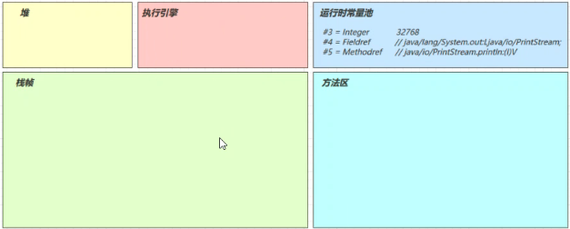

##### 4）方法字节码载入方法区

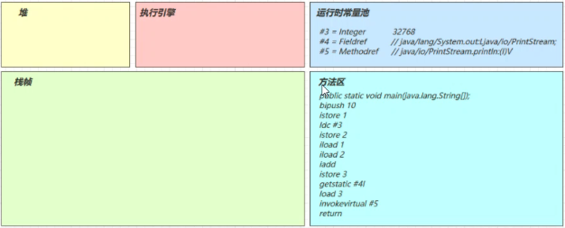

##### 5）main 线程开始运行，分配栈帧内存

（stack=2，locals=4）

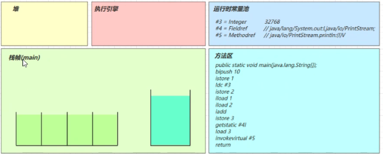

##### 6）执行引擎开始执行字节码

**bipush 10**

- 将一个 byte 压入操作数栈（其长度会补齐 4 个字节），类似的指令还有
- sipush 将一个 short 压入操作数栈（其长度会补齐 4 个字节）
- ldc 将一个 int 压入操作数栈
- ldc2_w 将一个 long 压入操作数栈（分两次压入，因为 long 是 8 个字节）
- 这里小的数字都是和字节码指令存在一起，超过 short 范围的数字存入了常量池

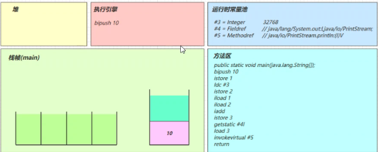

**istore_1**

- 将操作数栈顶数据弹出，存入局部变量表的 slot 1

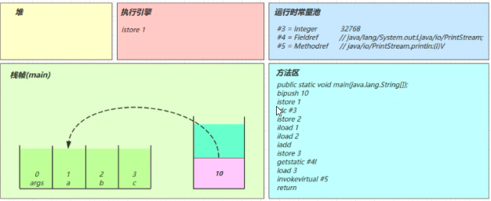

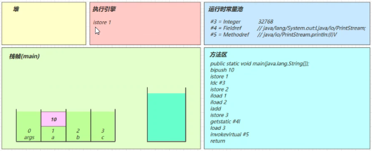

**ldc #3**

- 从常量池加载 #3 数据到操作数栈
- 注意 Short.MAX_VALUE 是 32767，所以 32768 = Short.MAX_VALUE + 1 实际是在编译期间计算好的

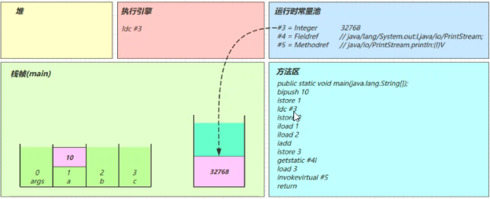

**istore_2**

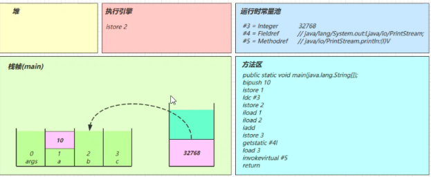

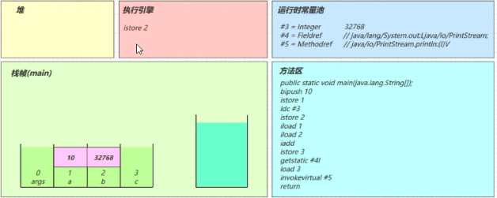

**iload_1**

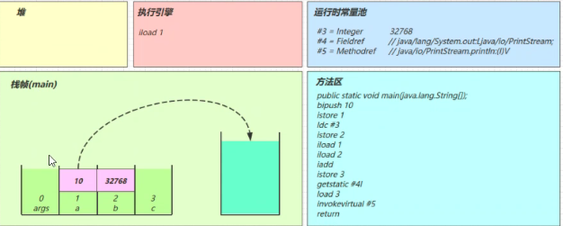

**iload_2**


**iadd**


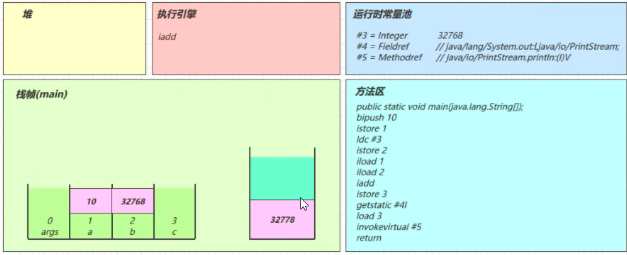

**istore_3**

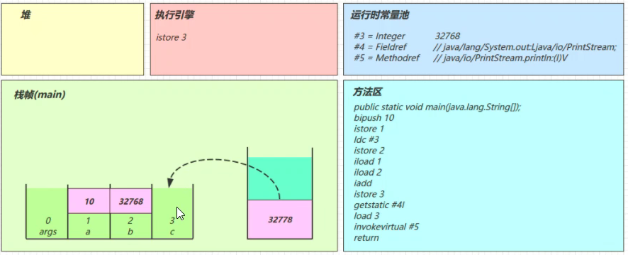

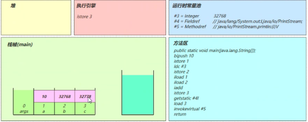

**getstatic #4**

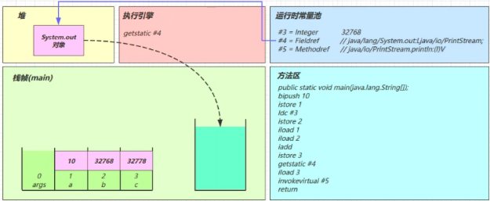

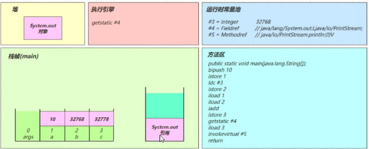

**iload_3**

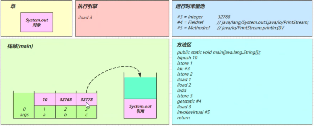

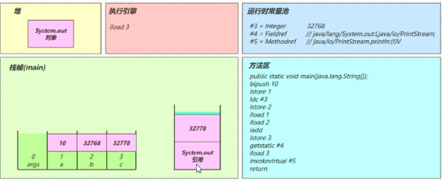

**invokevirtual #5**

- 找到常量池 #5 项
- 定位到方法区 java/io/PrintStream.println:(I)V 方法
- 生成新的栈帧（分配 locals、stack等）
- 传递参数，执行新栈帧中的字节码

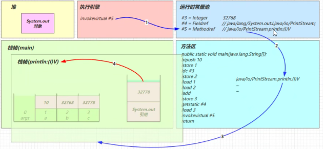

- 执行完毕，弹出栈帧
- 清除 main 操作数栈内容

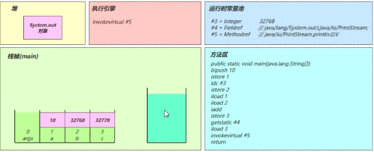

**return**

- 完成 main 方法调用，弹出 main 栈帧
- 程序结束


#### 2.4 分析 i++

目的：从字节码角度分析 a++ 相关题目

源码：

```java
/**
* 从字节码角度分析 a++ 相关题目
*/
public class Demo3_2 {
    public static void main(String[] args) {
        int a = 10;
        int b = a++ + ++a + a--;
        System.out.println(a);
        System.out.println(b);
    }
}
```

字节码：

```
public static void main(java.lang.String[]);
descriptor: ([Ljava/lang/String;)V
flags: (0x0009) ACC_PUBLIC, ACC_STATIC
Code:
stack=2, locals=3, args_size=1
0: bipush 10
2: istore_1
3: iload_1
4: iinc 1, 1
7: iinc 1, 1
10: iload_1
11: iadd
12: iload_1
13: iinc 1, -1
16: iadd
17: istore_2
18: getstatic #2 // Field
java/lang/System.out:Ljava/io/PrintStream;
21: iload_1
22: invokevirtual #3 // Method
java/io/PrintStream.println:(I)V
25: getstatic #2 // Field
java/lang/System.out:Ljava/io/PrintStream;
28: iload_2
29: invokevirtual #3 // Method
java/io/PrintStream.println:(I)V
32: return
LineNumberTable:
line 8: 0
line 9: 3
line 10: 18
line 11: 25
line 12: 32
LocalVariableTable:
Start Length Slot Name Signature
0 33 0 args [Ljava/lang/String;
3 30 1 a I
18 15 2 b I


```

分析：

- 注意 iinc 指令是直接在局部变量 slot 上进行运算
- a++ 和 ++a 的区别是先执行 iload 还是 先执行 iinc

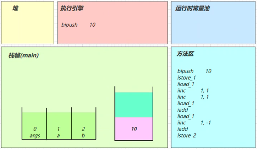

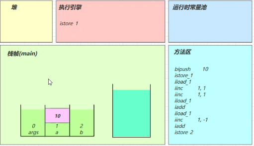


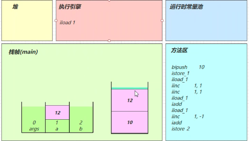

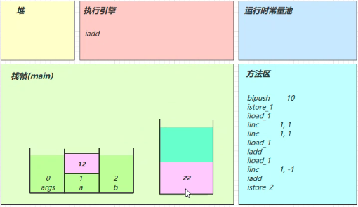

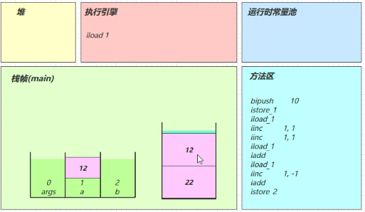

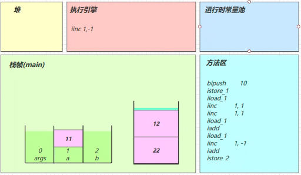

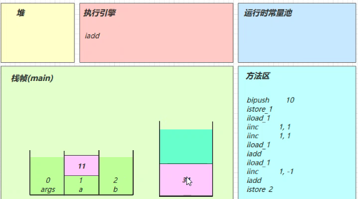

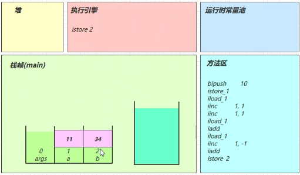


#### 2.5 条件判断指令

| 指令 | 助记符    | 含义             |
| ---- | --------- | ---------------- |
| 0x99 | ifeq      | 判断是否 == 0    |
| 0x9a | ifne      | 判断是否 != 0    |
| 0x9b | iflt      | 判断是否 < 0     |
| 0x9c | ifge      | 判断是否 >= 0    |
| 0x9d | ifgt      | 判断是否 > 0     |
| 0x9e | ifle      | 判断是否 <= 0    |
| 0x9f | if_icmpeq | 两个int是否 ==   |
| 0xa0 | if_icmpne | 两个int是否 !=   |
| 0xa1 | if_icmplt | 两个int是否 <    |
| 0xa2 | if_icmpge | 两个int是否 >=   |
| 0xa3 | if_icmpgt | 两个int是否 >    |
| 0xa4 | if_icmple | 两个int是否 <=   |
| 0xa5 | if_acmpeq | 两个引用是否 ==  |
| 0xa6 | if_acmpne | 两个引用是否 !=  |
| 0xc6 | ifnull    | 判断是否 == null |
| 0xc7 | ifnonnull | 判断是否 != null |

几点说明：

- byte，short，char 都会按 int 比较，因为操作数栈都是 4 字节
- goto 用来进行跳转到指定行号的字节码

源码：

```java
public class Demo3_3 {
    public static void main(String[] args) {
        int a = 0;
        if(a == 0) {
            a = 10;
        } else {
            a = 20;
        }
    }
}
```

字节码：

```
0: iconst_0
1: istore_1
2: iload_1
3: ifne 12
6: bipush 10
8: istore_1
9: goto 15
12: bipush 20
14: istore_1
15: return
```


#### 2.6 循环控制指令

其实循环控制还是前面介绍的那些指令，例如 while 循环：

```java
public class Demo3_4 {
    public static void main(String[] args) {
        int a = 0;
        while (a < 10) {
            a++;
        }
    }
}
```

字节码是：

```
0: iconst_0
1: istore_1
2: iload_1
3: bipush 10
5: if_icmpge 14
8: iinc 1, 1
11: goto 2
14: return
```

再比如 do while 循环：

```java
public class Demo3_5 {
    public static void main(String[] args) {
        int a = 0;
        do {
            a++;
        } while (a < 10);
    }
}
```

字节码是：

```
0: iconst_0 
1: istore_1 
2: iinc 1, 1 
5: iload_1 
6: bipush 10 
8: if_icmplt 2 
11: return
```

最后再看看 for 循环：

```java
public class Demo3_6 {
    public static void main(String[] args) {
        for (int i = 0; i < 10; i++) {
        }
    }
}
```

字节码是：

```
0: iconst_0
1: istore_1
2: iload_1
3: bipush 10
5: if_icmpge 14
8: iinc 1, 1
11: goto 2
14: return
```

> 注意
>
> 比较 while 和 for 的字节码，你发现它们是一模一样的，殊途也能同归


#### 2.7 判断结果

请从字节码角度分析，下列代码运行的结果：

```java
public class Demo3_6_1 {
    public static void main(String[] args) {
        int i = 0;
        int x = 0;
        while (i < 10) {
            x = x++;
            i++;
        }
        System.out.println(x); // 结果是 0
    }
}
```


#### 2.8 构造方法

##### 1） `<cinit>()V `

```java
public class Demo3_8_1 { 
    static int i = 10; 
    static { 
        i = 20; 
    } 
    static { 
        i = 30; 
    } 
}
```

编译器会按从上至下的顺序，收集所有 static 静态代码块和静态成员赋值的代码，合并为一个特殊的方 法 `<cinit>()V` ：

```
0: bipush 10
2: putstatic #2 // Field i:I
5: bipush 20
7: putstatic #2 // Field i:I
10: bipush 30
12: putstatic #2 // Field i:I
15: return
```

`<cinit>()V` 方法会在类加载的初始化阶段被调用

##### 2） `<init>()V` 

```java
public class Demo3_8_2 {
    private String a = "s1";
    {
        b = 20;
    }
    private int b = 10;
    {
        a = "s2";
    }
    public Demo3_8_2(String a, int b) {
        this.a = a;
        this.b = b;
    }
    
    public static void main(String[] args) {
        Demo3_8_2 d = new Demo3_8_2("s3", 30);
        System.out.println(d.a);
        System.out.println(d.b);
    }
}
```

编译器会按从上至下的顺序，收集所有 {} 代码块和成员变量赋值的代码，形成新的构造方法，但原始构 造方法内的代码总是在最后

```
public cn.itcast.jvm.t3.bytecode.Demo3_8_2(java.lang.String, int);
descriptor: (Ljava/lang/String;I)V
flags: ACC_PUBLIC
Code:
stack=2, locals=3, args_size=3
0: aload_0
1: invokespecial #1 // super.<init>()V
4: aload_0
5: ldc #2 // <- "s1"
7: putfield #3 // -> this.a
10: aload_0
11: bipush 20 // <- 20
13: putfield #4 // -> this.b
16: aload_0
17: bipush 10 // <- 10
19: putfield #4 // -> this.b
22: aload_0
23: ldc #5 // <- "s2"
25: putfield #3 // -> this.a
28: aload_0 // ------------------------------
29: aload_1 // <- slot 1(a) "s3" |
30: putfield #3 // -> this.a |
33: aload_0 |
34: iload_2 // <- slot 2(b) 30 |
35: putfield #4 // -> this.b --------------------
38: return
LineNumberTable: ...
LocalVariableTable:
Start Length Slot Name Signature
0 39 0 this Lcn/itcast/jvm/t3/bytecode/Demo3_8_2;
0 39 1 a Ljava/lang/String;
0 39 2 b I
MethodParameters: ...
```


#### 2.9 方法调用

看一下几种不同的方法调用对应的字节码指令

```java
public class Demo3_9 {
    public Demo3_9() { }
    private void test1() { }
    private final void test2() { }
    public void test3() { }
    public static void test4() { }
    public static void main(String[] args) {
        Demo3_9 d = new Demo3_9();
        d.test1();
        d.test2();
        d.test3();
        d.test4();
        Demo3_9.test4();
    }
}
```

字节码：

```
0: new #2 // class cn/itcast/jvm/t3/bytecode/Demo3_9
3: dup
4: invokespecial #3 // Method "<init>":()V
7: astore_1
8: aload_1
9: invokespecial #4 // Method test1:()V
12: aload_1
13: invokespecial #5 // Method test2:()V
16: aload_1
17: invokevirtual #6 // Method test3:()V
20: aload_1
21: pop
22: invokestatic #7 // Method test4:()V
25: invokestatic #7 // Method test4:()V
28: return
```

- new 是创建【对象】，给对象分配堆内存，执行成功会将【对象引用】压入操作数栈 
- dup 是赋值操作数栈栈顶的内容，本例即为【对象引用】，为什么需要两份引用呢，一个是要配 合 invokespecial 调用该对象的构造方法 "":()V （会消耗掉栈顶一个引用），另一个要 配合 astore_1 赋值给局部变量 
- 最终方法（final），私有方法（private），构造方法都是由 invokespecial 指令来调用，属于静 态绑定 
- 普通成员方法是由 invokevirtual 调用，属于动态绑定，即支持多态 
- 成员方法与静态方法调用的另一个区别是，执行方法前是否需要【对象引用】 
- 比较有意思的是 d.test4(); 是通过【对象引用】调用一个静态方法，可以看到在调用 invokestatic 之前执行了 pop 指令，把【对象引用】从操作数栈弹掉了
- 还有一个执行 invokespecial 的情况是通过 super 调用父类方法


#### 2.10 多态的原理

```java
import java.io.IOException;
/**
* 演示多态原理，注意加上下面的 JVM 参数，禁用指针压缩
* -XX:-UseCompressedOops -XX:-UseCompressedClassPointers
*/
public class Demo3_10 {
    public static void test(Animal animal) {
        animal.eat();
        System.out.println(animal.toString());
    }
    public static void main(String[] args) throws IOException {
        test(new Cat());
        test(new Dog());
        System.in.read();
    }
}
abstract class Animal {
    public abstract void eat();
    @Override
    public String toString() {
        return "我是" + this.getClass().getSimpleName();
    }
}
class Dog extends Animal {
    @Override
    public void eat() {
        System.out.println("啃骨头");
    }
}
class Cat extends Animal {
    @Override
    public void eat() {
        System.out.println("吃鱼");
    }
}
```

##### 1）运行代码

停在 System.in.read() 方法上，这时运行 jps 获取进程 id

##### 2）运行 HSDB 工具

进入 JDK 安装目录，执行

`java -cp ./lib/sa-jdi.jar sun.jvm.hotspot.HSDB`

进入图形界面 attach 进程 id

##### 3）查找某个对象 

打开 Tools -> Find Object By Query 

输入 select d from cn.itcast.jvm.t3.bytecode.Dog d 点击 Execute 执行

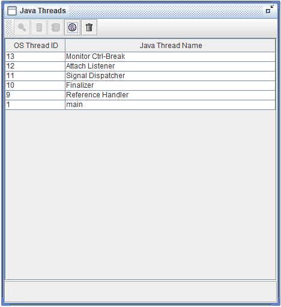

##### 4）查看对象内存结构

点击超链接可以看到对象的内存结构，此对象没有任何属性，因此只有对象头的 16 字节，前 8 字节是 MarkWord，后 8 字节就是对象的 Class 指针

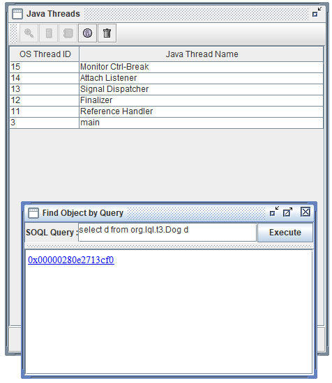

但目前看不到它的实际地址

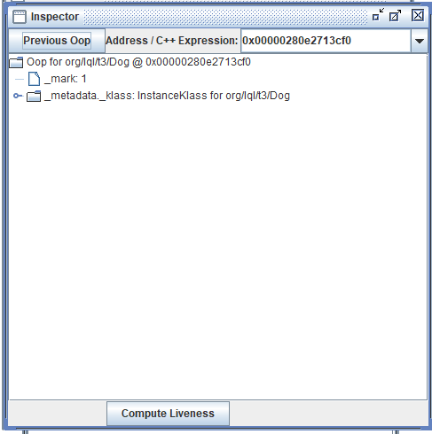

##### 5）查看对象 Class 的内存地址 

可以通过 Windows -> Console 进入命令行模式，执行

`mem 0x00000001299b4978 2`

mem 有两个参数，参数 1 是对象地址，参数 2 是查看 2 行（即 16 字节）

结果中第二行 0x000000001b7d4028 即为 Class 的内存地址

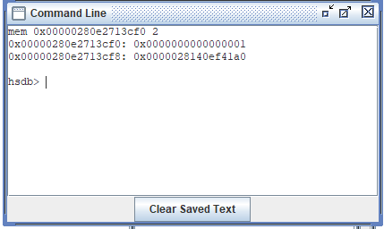

##### 6）查看类的 vtable

- 方法1：Alt+R 进入 Inspector 工具，输入刚才的 Class 内存地址，看到如下界面

  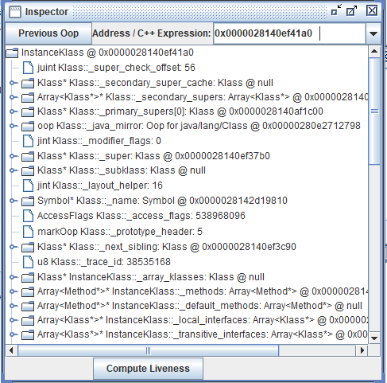

- 方法2：或者 Tools -> Class Browser 输入 Dog 查找，可以得到相同的结果

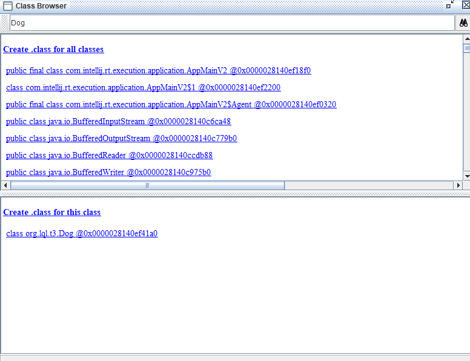

无论通过哪种方法，都可以找到 Dog Class 的 vtable 长度为 6，意思就是 Dog 类有 6 个虚方法（多态 相关的，final，static 不会列入） 

那么这 6 个方法都是谁呢？从 Class 的起始地址开始算，偏移 0x1b8 就是 vtable 的起始地址，进行计 算得到：

```
0x000000001b7d4028
			  1b8 +
---------------------
0x000000001b7d41e0
```

通过 Windows -> Console 进入命令行模式，执行

```
mem 0x000000001b7d41e0 6

0x000000001b7d41e0: 0x000000001b3d1b10
0x000000001b7d41e8: 0x000000001b3d15e8
0x000000001b7d41f0: 0x000000001b7d35e8
0x000000001b7d41f8: 0x000000001b3d1540
0x000000001b7d4200: 0x000000001b3d1678
0x000000001b7d4208: 0x000000001b7d3fa8
```

就得到了 6 个虚方法的入口地址

##### 7）验证方法地址

通过 Tools -> Class Browser 查看每个类的方法定义，比较可知

```
Dog - public void eat() @0x000000001b7d3fa8
Animal - public java.lang.String toString() @0x000000001b7d35e8;
Object - protected void finalize() @0x000000001b3d1b10;
Object - public boolean equals(java.lang.Object) @0x000000001b3d15e8;
Object - public native int hashCode() @0x000000001b3d1540;
Object - protected native java.lang.Object clone() @0x000000001b3d1678;
```

对号入座，发现 

- eat() 方法是 Dog 类自己的
- toString() 方法是继承 String 类的 finalize()

##### 8）小结

当执行 invokevirtual 指令时， 

1. 先通过栈帧中的对象引用找到对象 
2. 分析对象头，找到对象的实际 Class 
3. Class 结构中有 vtable，它在类加载的链接阶段就已经根据方法的重写规则生成好了 
4. 查表得到方法的具体地址 
5. 执行方法的字节码


#### 2.11 异常处理

**try-catch**

```java
public class Demo3_11_1 {
    public static void main(String[] args) {
        int i = 0;
        try {
            i = 10;
        } catch (Exception e) {
            i = 20;
        }
    }
}
```

> 注意
>
> 为了抓住重点，下面的字节码省略了不重要的部分

```
public static void main(java.lang.String[]);
descriptor: ([Ljava/lang/String;)V
flags: ACC_PUBLIC, ACC_STATIC
Code:
stack=1, locals=3, args_size=1
0: iconst_0
1: istore_1
2: bipush 10
4: istore_1
5: goto 12
8: astore_2
9: bipush 20
11: istore_1
12: return
Exception table:
from to target type
2 5 8 Class java/lang/Exception
LineNumberTable: ...
LocalVariableTable:
Start Length Slot Name Signature
9 3 2 e Ljava/lang/Exception;
0 13 0 args [Ljava/lang/String;
2 11 1 i I
StackMapTable: ...
MethodParameters: ...
}
```

- 可以看到多出来一个 Exception table 的结构，[from, to) 是前闭后开的检测范围，一旦这个范围 内的字节码执行出现异常，则通过 type 匹配异常类型，如果一致，进入 target 所指示行号 
- 8 行的字节码指令 astore_2 是将异常对象引用存入局部变量表的 slot 2 位置


**多个 single-catch 块的情况**

```java
public class Demo3_11_2 {
    public static void main(String[] args) {
        int i = 0;
        try {
            i = 10;
        } catch (ArithmeticException e) {
            i = 30;
        } catch (NullPointerException e) {
            i = 40;
        } catch (Exception e) {
            i = 50;
        }
    }
}
```

```
public static void main(java.lang.String[]);
descriptor: ([Ljava/lang/String;)V
flags: ACC_PUBLIC, ACC_STATIC
Code:
stack=1, locals=3, args_size=1
0: iconst_0
1: istore_1
2: bipush 10
4: istore_1
5: goto 26
8: astore_2
9: bipush 30
11: istore_1
12: goto 26
15: astore_2
16: bipush 40
18: istore_1
19: goto 26
22: astore_2
23: bipush 50
25: istore_1
26: return
Exception table:
from to target type
2 5 8 Class java/lang/ArithmeticException
2 5 15 Class java/lang/NullPointerException
2 5 22 Class java/lang/Exception
LineNumberTable: ...
LocalVariableTable:
Start Length Slot Name Signature
9 3 2 e Ljava/lang/ArithmeticException;
16 3 2 e Ljava/lang/NullPointerException;
23 3 2 e Ljava/lang/Exception;
0 27 0 args [Ljava/lang/String;
2 25 1 i I
StackMapTable: ...
MethodParameters: ...
```

- 因为异常出现时，只能进入 Exception table 中一个分支，所以局部变量表 slot 2 位置被共用


**multi-catch 的情况**

```java
public class Demo3_11_3 {
    public static void main(String[] args) {
        try {
            Method test = Demo3_11_3.class.getMethod("test");
            test.invoke(null);
        } catch (NoSuchMethodException | IllegalAccessException |
                 InvocationTargetException e) {
            e.printStackTrace();
        }
    }
    public static void test() {
        System.out.println("ok");
    }
}
```

```
public static void main(java.lang.String[]);
descriptor: ([Ljava/lang/String;)V
flags: ACC_PUBLIC, ACC_STATIC
Code:
stack=3, locals=2, args_size=1
0: ldc #2
2: ldc #3
4: iconst_0
5: anewarray #4
8: invokevirtual #5
11: astore_1
12: aload_1
13: aconst_null
14: iconst_0
15: anewarray #6
18: invokevirtual #7
21: pop
22: goto 30
25: astore_1
26: aload_1
27: invokevirtual #11 // e.printStackTrace:()V
30: return
Exception table:
from to target type
0 22 25 Class java/lang/NoSuchMethodException
0 22 25 Class java/lang/IllegalAccessException
0 22 25 Class java/lang/reflect/InvocationTargetException
LineNumberTable: ...
LocalVariableTable:
Start Length Slot Name Signature
12 10 1 test Ljava/lang/reflect/Method;
26 4 1 e Ljava/lang/ReflectiveOperationException;
0 31 0 args [Ljava/lang/String;
StackMapTable: ...
MethodParameters: ...
```


**finally**

```java
public class Demo3_11_4 {
    public static void main(String[] args) {
        int i = 0;
        try {
            i = 10;
        } catch (Exception e) {
            i = 20;
        } finally {
            i = 30;
        }
    }
}
```

```
public static void main(java.lang.String[]);
descriptor: ([Ljava/lang/String;)V
flags: ACC_PUBLIC, ACC_STATIC
Code:
stack=1, locals=4, args_size=1
0: iconst_0
1: istore_1 // 0 -> i
2: bipush 10 // try --------------------------------------
4: istore_1 // 10 -> i |
5: bipush 30 // finally |
7: istore_1 // 30 -> i |
8: goto 27 // return -----------------------------------
11: astore_2 // catch Exceptin -> e ----------------------12: bipush 20 // |
12: bipush 20 // |
14: istore_1 // 20 -> i |
15: bipush 30 // finally |
17: istore_1 // 30 -> i |
18: goto 27 // return -----------------------------------
21: astore_3 // catch any -> slot 3 ----------------------
22: bipush 30 // finally |
24: istore_1 // 30 -> i |
25: aload_3 // <- slot 3 |
26: athrow // throw ------------------------------------
27: return
Exception table:
from to target type
2 5 11 Class java/lang/Exception
2 5 21 any // 剩余的异常类型，比如 Error
11 15 21 any // 剩余的异常类型，比如 Error
LineNumberTable: ...
LocalVariableTable:
Start Length Slot Name Signature
12 3 2 e Ljava/lang/Exception;
0 28 0 args [Ljava/lang/String;
2 26 1 i I
StackMapTable: ...
MethodParameters: ...
```

可以看到 finally 中的代码被复制了 3 份，分别放入 try 流程，catch 流程以及 catch 剩余的异常类型流程


#### 2.12 finally 面试题

**finally 出现了 return**

```java
public class Demo3_12_2 {
    public static void main(String[] args) {
        int result = test();
        System.out.println(result);
    }
    public static int test() {
        try {
            return 10;
        } finally {
            return 20;
        }
    }
}
```

```
public static int test();
descriptor: ()I
flags: ACC_PUBLIC, ACC_STATIC
Code:
stack=1, locals=2, args_size=0
0: bipush 10 // <- 10 放入栈顶
2: istore_0 // 10 -> slot 0 (从栈顶移除了)
3: bipush 20 // <- 20 放入栈顶
5: ireturn // 返回栈顶 int(20)
6: astore_1 // catch any -> slot 1
7: bipush 20 // <- 20 放入栈顶
9: ireturn // 返回栈顶 int(20)
Exception table:
from to target type
0 3 6 any
LineNumberTable: ...
StackMapTable: ...

```

- 由于 finally 中的 ireturn 被插入了所有可能的流程，因此返回结果肯定以 finally 的为准 
- 至于字节码中第 2 行，似乎没啥用，且留个伏笔，看下个例子 
- 跟上例中的 finally 相比，发现没有 athrow 了，这告诉我们：如果在 finally 中出现了 return，会 吞掉异常

```java
public class Demo3_12_1 {
    public static void main(String[] args) {
        int result = test();
        System.out.println(result);
    }
    public static int test() {
        try {
            int i = 1/0;
            return 10;
        } finally {
            return 20;
        }
    }
}
```


**finally 对返回值影响**

```java
public class Demo3_12_2 {
    public static void main(String[] args) {
        int result = test();
        System.out.println(result);
    }
    public static int test() {
        int i = 10;
        try {
            return i;
        } finally {
            i = 20;
        }
    }
}
```

```
public static int test();
descriptor: ()I
flags: ACC_PUBLIC, ACC_STATIC
Code:
stack=1, locals=3, args_size=0
0: bipush 10 // <- 10 放入栈顶
2: istore_0 // 10 -> i
3: iload_0 // <- i(10)
4: istore_1 // 10 -> slot 1，暂存至 slot 1，目的是为了固定返回值
5: bipush 20 // <- 20 放入栈顶
7: istore_0 // 20 -> i
8: iload_1 // <- slot 1(10) 载入 slot 1 暂存的值
9: ireturn // 返回栈顶的 int(10)
10: astore_2
11: bipush 20
13: istore_0
14: aload_2
15: athrow
Exception table:
from to target type
3 5 10 any
LineNumberTable: ...
LocalVariableTable:
Start Length Slot Name Signature
3 13 0 i I
StackMapTable: ...
```


#### 2.13 synchronized

```java
public class Demo3_13 {
    public static void main(String[] args) {
        Object lock = new Object();
        synchronized (lock) {
            System.out.println("ok");
        }
    }
}
```

```
public static void main(java.lang.String[]);
descriptor: ([Ljava/lang/String;)V
flags: ACC_PUBLIC, ACC_STATIC
Code:
stack=2, locals=4, args_size=1
0: new #2 // new Object
3: dup
4: invokespecial #1 // invokespecial <init>:()V
7: astore_1 // lock引用 -> lock
8: aload_1 // <- lock （synchronized开始）
9: dup
10: astore_2 // lock引用 -> slot 2
11: monitorenter // monitorenter(lock引用)
12: getstatic #3 // <- System.out
15: ldc  #4 // <- "ok"
7: invokevirtual #5 // invokevirtual println:
(Ljava/lang/String;)V
20: aload_2 // <- slot 2(lock引用)
21: monitorexit // monitorexit(lock引用)
22: goto 30
25: astore_3 // any -> slot 3
26: aload_2 // <- slot 2(lock引用)
27: monitorexit // monitorexit(lock引用)
28: aload_3
29: athrow
30: return
Exception table:
from to target type
12 22 25 any
25 28 25 any
LineNumberTable: ...
LocalVariableTable:
Start Length Slot Name Signature
0 31 0 args [Ljava/lang/String;
8 23 1 lock Ljava/lang/Object;
StackMapTable: ...
MethodParameters: ...
```

> 注意
>
> 方法级别的 synchronized 不会在字节码指令中有所体现


### 3. 编译期处理

所谓的 **语法糖** ，其实就是指 java 编译器把 *.java 源码编译为 *.class 字节码的过程中，自动生成 和转换的一些代码，主要是为了减轻程序员的负担，算是 java 编译器给我们的一个额外福利（给糖吃嘛）

注意，以下代码的分析，借助了 javap 工具，idea 的反编译功能，idea 插件 jclasslib 等工具。另外， 编译器转换的结果直接就是 class 字节码，只是为了便于阅读，给出了 几乎等价 的 java 源码方式，并 不是编译器还会转换出中间的 java 源码，切记。

#### 3.1 默认构造器

```java
public class Candy1 {
}
```

编译成class后的代码：

```java
public class Candy1 {
    // 这个无参构造是编译器帮助我们加上的
    public Candy1() {
        super(); // 即调用父类 Object 的无参构造方法，即调用 java/lang/Object."
        <init>":()V
    }
}
```


#### 3.2 自动拆装箱

这个特性是 JDK 5 开始加入的， 代码片段1 ：

```java
public class Candy2 {
    public static void main(String[] args) {
        Integer x = 1;
        int y = x;
    }
}
```

这段代码在 JDK 5 之前是无法编译通过的，必须改写为 代码片段2 :

```java
public class Candy2 {
    public static void main(String[] args) {
        Integer x = Integer.valueOf(1);
        int y = x.intValue();
    }
}
```

显然之前版本的代码太麻烦了，需要在基本类型和包装类型之间来回转换（尤其是集合类中操作的都是 包装类型），因此这些转换的事情在 JDK 5 以后都由编译器在编译阶段完成。即 代码片段1 都会在编 译阶段被转换为 代码片段2


#### 3.3 泛型集合取值

泛型也是在 JDK 5 开始加入的特性，但 java 在编译泛型代码后会执行 泛型擦除 的动作，即泛型信息 在编译为字节码之后就丢失了，实际的类型都当做了 Object 类型来处理：

```java
public class Candy3 {
    public static void main(String[] args) {
        List<Integer> list = new ArrayList<>();
        list.add(10); // 实际调用的是 List.add(Object e)
        Integer x = list.get(0); // 实际调用的是 Object obj = List.get(int index);
    }
}
```

所以在取值时，编译器真正生成的字节码中，还要额外做一个类型转换的操作：

```java
// 需要将 Object 转为 Integer
Integer x = (Integer)list.get(0);
```

如果前面的 x 变量类型修改为 int 基本类型那么最终生成的字节码是：

```java
// 需要将 Object 转为 Integer, 并执行拆箱操作
int x = ((Integer)list.get(0)).intValue();
```

还好这些麻烦事都不用自己做。


擦除的是字节码上的泛型信息，可以看到 LocalVariableTypeTable 仍然保留了方法参数泛型的信息

```
public cn.itcast.jvm.t3.candy.Candy3();
descriptor: ()V
flags: ACC_PUBLIC
Code:
stack=1, locals=1, args_size=1
0: aload_0
1: invokespecial #1 // Method java/lang/Object."
<init>":()V
4: return
LineNumberTable:
line 6: 0
LocalVariableTable:
Start Length Slot Name Signature
0 5 0 this Lcn/itcast/jvm/t3/candy/Candy3;
public static void main(java.lang.String[]);
descriptor: ([Ljava/lang/String;)V
flags: ACC_PUBLIC, ACC_STATIC
Code:
stack=2, locals=3, args_size=1
0: new #2 // class java/util/ArrayList
stack=2, locals=3, args_size=1
0: new #2 // class java/util/ArrayList
3: dup
4: invokespecial #3 // Method java/util/ArrayList."
<init>":()V
7: astore_1
8: aload_1
9: bipush 10
11: invokestatic #4 // Method
java/lang/Integer.valueOf:(I)Ljava/lang/Integer;
14: invokeinterface #5, 2 // InterfaceMethod
java/util/List.add:(Ljava/lang/Object;)Z
19: pop
20: aload_1
21: iconst_0
22: invokeinterface #6, 2 // InterfaceMethod
java/util/List.get:(I)Ljava/lang/Object;
27: checkcast #7 // class java/lang/Integer
30: astore_2
31: return
LineNumberTable:
line 8: 0
line 9: 8
line 10: 20
line 11: 31
LocalVariableTable:
Start Length Slot Name Signature
0 32 0 args [Ljava/lang/String;
8 24 1 list Ljava/util/List;
LocalVariableTypeTable:
Start Length Slot Name Signature
8 24 1 list Ljava/util/List<Ljava/lang/Integer;>;
```

使用反射，仍然能够获得这些信息：

```java
public Set<Integer> test(List<String> list, Map<Integer, Object> map) {
}
```

```java
Method test = Candy3.class.getMethod("test", List.class, Map.class);
Type[] types = test.getGenericParameterTypes();
for (Type type : types) {
    if (type instanceof ParameterizedType) {
        ParameterizedType parameterizedType = (ParameterizedType) type;
        System.out.println("原始类型 - " + parameterizedType.getRawType());
        Type[] arguments = parameterizedType.getActualTypeArguments();
        for (int i = 0; i < arguments.length; i++) {
            System.out.printf("泛型参数[%d] - %s\n", i, arguments[i]);
        }
    }
}
```

输出

```
原始类型 - interface java.util.List
泛型参数[0] - class java.lang.String
原始类型 - interface java.util.Map
泛型参数[0] - class java.lang.Integer
泛型参数[1] - class java.lang.Object
```


#### 3.4 可变参数

可变参数也是 JDK 5 开始加入的新特性： 例如：

```java
public class Candy4 {
    public static void foo(String... args) {
        String[] array = args; // 直接赋值
        System.out.println(array);
    }
    public static void main(String[] args) {
        foo("hello", "world");
    }
}
```

可变参数 String... args 其实是一个 String[] args ，从代码中的赋值语句中就可以看出来。 同 样 java 编译器会在编译期间将上述代码变换为：

```java
public class Candy4 {
    public static void foo(String[] args) {
        String[] array = args; // 直接赋值
        System.out.println(array);
    }
    public static void main(String[] args) {
        foo(new String[]{"hello", "world"});
    }
}
```

> 注意 如果调用了 foo() 则等价代码为 foo(new String[]{}) ，创建了一个空的数组，而不会 传递 null 进去


#### 3.5 foreach 循环

仍是 JDK 5 开始引入的语法糖，数组的循环：

```java
public class Candy5_1 {
    public static void main(String[] args) {
        int[] array = {1, 2, 3, 4, 5}; // 数组赋初值的简化写法也是语法糖哦
        for (int e : array) {
            System.out.println(e);
        }
    }
}
```

会被编译器转换为： 

```java
public class Candy5_1 {
    public Candy5_1() {
    }
    public static void main(String[] args) {
        int[] array = new int[]{1, 2, 3, 4, 5};
        for(int i = 0; i < array.length; ++i) {
            int e = array[i];
            System.out.println(e);
        }
    }
}
```

而集合的循环： 

```java
public class Candy5_2 {
    public static void main(String[] args) {
        List<Integer> list = Arrays.asList(1,2,3,4,5);
        for (Integer i : list) {
            System.out.println(i);
        }
    }
}
```

实际被编译器转换为对迭代器的调用：

```java
public class Candy5_2 {
    public Candy5_2() {
    }
    public static void main(String[] args) {
        List<Integer> list = Arrays.asList(1, 2, 3, 4, 5);
        Iterator iter = list.iterator();
        while(iter.hasNext()) {
            Integer e = (Integer)iter.next();
            System.out.println(e);
        }
    }
}
```

>  注意 foreach 循环写法，能够配合数组，以及所有实现了 Iterable 接口的集合类一起使用，其 中 Iterable 用来获取集合的迭代器（ Iterator ） 


#### 3.6 switch 字符串

从 JDK 7 开始，switch 可以作用于字符串和枚举类，这个功能其实也是语法糖，例如：

```java
public class Candy6_1 {
    public static void choose(String str) {
        switch (str) {
            case "hello": {
                System.out.println("h");
                break;
            }
            case "world": {
                System.out.println("w");
                break;
            }
        }
    }
}
```

> 注意 switch 配合 String 和枚举使用时，变量不能为null，原因分析完语法糖转换后的代码应当自 然清楚

会被编译器转换为：

```java
public class Candy6_1 {
    public Candy6_1() {
    }
    public static void choose(String str) {
        byte x = -1;
        switch(str.hashCode()) {
            case 99162322: // hello 的 hashCode
                if (str.equals("hello")) {
                    x = 0;
                }
                break;
            case 113318802: // world 的 hashCode
                if (str.equals("world")) {
                    x = 1;
                }
        }
        switch(x) {
            case 0:
                System.out.println("h");
                break;
            case 1:
                System.out.println("w");
        }
    }
}
```

可以看到，执行了两遍 switch，第一遍是根据字符串的 hashCode 和 equals 将字符串的转换为相应 byte 类型，第二遍才是利用 byte 执行进行比较。

为什么第一遍时必须既比较 hashCode，又利用 equals 比较呢？hashCode 是为了提高效率，减少可 能的比较；而 equals 是为了防止 hashCode 冲突，例如 BM 和 C. 这两个字符串的hashCode值都是 2123 ，如果有如下代码：

```java
public class Candy6_2 {
    public static void choose(String str) {
        switch (str) {
            case "BM": {
                System.out.println("h");
                break;
            }
            case "C.": {
                System.out.println("w");
                break;
            }
        }
    }
}
```

会被编译器转换为：

```java
public class Candy6_2 {
    public Candy6_2() {
    }
    public static void choose(String str) {
        byte x = -1;
        switch(str.hashCode()) {
            case 2123: // hashCode 值可能相同，需要进一步用 equals 比较
                if (str.equals("C.")) {
                    x = 1;
                } else if (str.equals("BM")) {
                    x = 0;
                }
            default:
                switch(x) {
                    case 0:
                        System.out.println("h");
                        break;
                    case 1:
                        System.out.println("w");
                }
        }
    }
}
```


#### 3.7 switch 枚举

switch 枚举的例子，原始代码：

```java
enum Sex {
    MALE, FEMALE
}
```

```java
public class Candy7 {
    public static void foo(Sex sex) {
        switch (sex) {
            case MALE:
                System.out.println("男"); break;
            case FEMALE:
                System.out.println("女"); break;
        }
    }
}
```

转换后代码：

```java
public class Candy7 {
    /**
* 定义一个合成类（仅 jvm 使用，对我们不可见）
* 用来映射枚举的 ordinal 与数组元素的关系
* 枚举的 ordinal 表示枚举对象的序号，从 0 开始
* 即 MALE 的 ordinal()=0，FEMALE 的 ordinal()=1
*/
    static class $MAP {
        // 数组大小即为枚举元素个数，里面存储case用来对比的数字
        static int[] map = new int[2];
        static {
            map[Sex.MALE.ordinal()] = 1;
            map[Sex.FEMALE.ordinal()] = 2;
        }
    }
    public static void foo(Sex sex) {
        int x = $MAP.map[sex.ordinal()];
        switch (x) {
            case 1:
                System.out.println("男");
                break;
            case 2:
                System.out.println("女");
                break;
        }
    }
}
```


#### 3.8 枚举类

JDK 7 新增了枚举类，以前面的性别枚举为例：

```java
enum Sex {
    MALE, FEMALE
}
```

转换后代码：

```java
public final class Sex extends Enum<Sex> {
public static final Sex MALE;
public static final Sex FEMALE;
private static final Sex[] $VALUES;
static {
MALE = new Sex("MALE", 0);
FEMALE = new Sex("FEMALE", 1);
$VALUES = new Sex[]{MALE, FEMALE};
}
/**
* Sole constructor. Programmers cannot invoke this constructor.
* It is for use by code emitted by the compiler in response to
* enum type declarations.
*
* @param name - The name of this enum constant, which is the identifier
* used to declare it.
* @param ordinal - The ordinal of this enumeration constant (its position
* in the enum declaration, where the initial constant is assigned
*/
    private Sex(String name, int ordinal) {
        super(name, ordinal);
    }
    public static Sex[] values() {
        return $VALUES.clone();
    }
    public static Sex valueOf(String name) {
        return Enum.valueOf(Sex.class, name);
    }
}
```


#### 3.9 try-with-resources

JDK 7 开始新增了对需要关闭的资源处理的特殊语法 `try-with-resources`：

```java
try(资源变量 = 创建资源对象){
} catch( ) {
}
```

其中资源对象需要实现 AutoCloseable 接口，例如 InputStream 、 OutputStream 、 Connection 、 Statement 、 ResultSet 等接口都实现了 AutoCloseable ，使用 try-withresources 可以不用写 finally 语句块，编译器会帮助生成关闭资源代码，例如：

```java
public class Candy9 {
    public static void main(String[] args) {
        try(InputStream is = new FileInputStream("d:\\1.txt")) {
            System.out.println(is);
        } catch (IOException e) {
            e.printStackTrace();
        }
    }
}
```

会被转换为：

```java
public class Candy9 {
    public Candy9() {
    }
    public static void main(String[] args) {
        try {
            InputStream is = new FileInputStream("d:\\1.txt");
            Throwable t = null;
            try {
                System.out.println(is);
            } catch (Throwable e1) {
                // t 是我们代码出现的异常
                t = e1;
                throw e1;
            } finally {
                // 判断了资源不为空
                if (is != null) {
                    // 如果我们代码有异常
                    if (t != null) {
                        try {
                            is.close();
                        } catch (Throwable e2) {
                            // 如果 close 出现异常，作为被压制异常添加
                            t.addSuppressed(e2);
                        }
                    } else {
                        // 如果我们代码没有异常，close 出现的异常就是最后 catch 块中的 e
                        is.close();
                    }
                }
            }
        } catch (IOException e) {
            e.printStackTrace();
        }
    }
}
```

为什么要设计一个 addSuppressed(Throwable e) （添加被压制异常）的方法呢？是为了防止异常信 息的丢失（想想 try-with-resources 生成的 fianlly 中如果抛出了异常）：

```java
public class Test6 {
    public static void main(String[] args) {
        try (MyResource resource = new MyResource()) {
            int i = 1/0;
        } catch (Exception e) {
            e.printStackTrace();
        }
    }
}
class MyResource implements AutoCloseable {
    public void close() throws Exception {
        throw new Exception("close 异常");
    }
}
```

输出：

```
java.lang.ArithmeticException: / by zero
    at test.Test6.main(Test6.java:7)
    Suppressed: java.lang.Exception: close 异常
        at test.MyResource.close(Test6.java:18)
        at test.Test6.main(Test6.java:6)
```

如以上代码所示，两个异常信息都不会丢。 


#### 3.10 方法重写时的桥接方法

方法重写时对返回值分两种情况： 

- 父子类的返回值完全一致 
- 子类返回值可以是父类返回值的子类（比较绕口，见下面的例子）

```java
class A {
    public Number m() {
        return 1;
    }
}
class B extends A {
    @Override
    // 子类 m 方法的返回值是 Integer 是父类 m 方法返回值 Number 的子类
    public Integer m() {
        return 2;
    }
}
```

对于子类，java 编译器会做如下处理：

```java
class B extends A {
    public Integer m() {
        return 2;
    }
    // 此方法才是真正重写了父类 public Number m() 方法
    public synthetic bridge Number m() {
        // 调用 public Integer m()
        return m();
    }
}
```

其中桥接方法比较特殊，仅对 java 虚拟机可见，并且与原来的 public Integer m() 没有命名冲突，可以 用下面反射代码来验证：

```java
for (Method m : B.class.getDeclaredMethods()) {
    System.out.println(m);
}
```

会输出：

```java
public java.lang.Integer test.candy.B.m()
public java.lang.Number test.candy.B.m()
```


#### 3.11 匿名内部类

源代码：

```java
public class Candy11 {
    public static void main(String[] args) {
        Runnable runnable = new Runnable() {
            @Override
            public void run() {
                System.out.println("ok");
            }
        };
    }
}
```

转换后代码：

```java
// 额外生成的类
final class Candy11$1 implements Runnable {
    Candy11$1() {
    }
    public void run() {
        System.out.println("ok");
    }
}
```

```java
public class Candy11 {
    public static void main(String[] args) {
        Runnable runnable = new Candy11$1();
    }
}
```

引用局部变量的匿名内部类，源代码：

```java
public class Candy11 {
    public static void test(final int x) {
        Runnable runnable = new Runnable() {
            @Override
            public void run() {
                System.out.println("ok:" + x);
            }
        };
    }
}
```

转换后代码：

```java
// 额外生成的类
final class Candy11$1 implements Runnable {
    int val$x;
    Candy11$1(int x) {
        this.val$x = x;
    }
    public void run() {
        System.out.println("ok:" + this.val$x);
    }
}

public class Candy11 {
    public static void test(final int x) {
        Runnable runnable = new Candy11$1(x);
    }
}
```

> 注意 这同时解释了为什么匿名内部类引用局部变量时，局部变量必须是 final 的：因为在创建 Candy11$1 对象时，将 x 的值赋值给了 Candy11$1 对象的 val x属 性 ，所以x不应该再发生变化了，如果 变化，那么valx属性没有机会再跟着一起变化


### 4. 类加载阶段

#### 4.1 加载

- 将类的字节码载入方法区中，内部采用 C++ 的 instanceKlass 描述 java 类，它的重要 field 有： 
  - _java_mirror 即 java 的类镜像，例如对 String 来说，就是 String.class，作用是把 klass 暴露给 java 使用 
  - _super 即父类 
  - _fields 即成员变量 
  - _methods 即方法 
  - _constants 即常量池 
  - _class_loader 即类加载器 
  - _vtable 虚方法表 
  - _itable 接口方法表 
- 如果这个类还有父类没有加载，先加载父类 
- 加载和链接可能是交替运行的

> 注意 
>
> - instanceKlass 这样的【元数据】是存储在方法区（1.8 后的元空间内），但 _java_mirror 是存储在堆中 
> - 可以通过前面介绍的 HSDB 工具查看

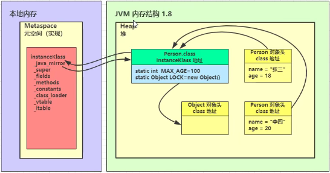


#### 4.2 链接

**验证**

验证类是否符合 JVM规范，安全性检查

用 UE 等支持二进制的编辑器修改 HelloWorld.class 的魔数，在控制台运行

```
E:\git\jvm\out\production\jvm>java cn.itcast.jvm.t5.HelloWorld
Error: A JNI error has occurred, please check your installation and try again
Exception in thread "main" java.lang.ClassFormatError: Incompatible magic value
3405691578 in class file cn/itcast/jvm/t5/HelloWorld
    at java.lang.ClassLoader.defineClass1(Native Method)
    at java.lang.ClassLoader.defineClass(ClassLoader.java:763)
    at java.security.SecureClassLoader.defineClass(SecureClassLoader.java:142)
    at java.net.URLClassLoader.defineClass(URLClassLoader.java:467)
    at java.net.URLClassLoader.access$100(URLClassLoader.java:73)
    at java.net.URLClassLoader$1.run(URLClassLoader.java:368)
    at java.net.URLClassLoader$1.run(URLClassLoader.java:362)
    at java.security.AccessController.doPrivileged(Native Method)
    at java.net.URLClassLoader.findClass(URLClassLoader.java:361)
    at java.lang.ClassLoader.loadClass(ClassLoader.java:424)
    at sun.misc.Launcher$AppClassLoader.loadClass(Launcher.java:331)
    at java.lang.ClassLoader.loadClass(ClassLoader.java:357)
    at sun.launcher.LauncherHelper.checkAndLoadMain(LauncherHelper.java:495)
```

**准备**

为 static 变量分配空间，设置默认值

- static 变量在 JDK 7 之前存储于 instanceKlass 末尾，从 JDK 7 开始，存储于 _java_mirror 末尾 
- static 变量分配空间和赋值是两个步骤，分配空间在准备阶段完成，赋值在初始化阶段完成 
- 如果 static 变量是 final 的基本类型，以及字符串常量，那么编译阶段值就确定了，赋值在准备阶 段完成 
- 如果 static 变量是 final 的，但属于引用类型，那么赋值也会在初始化阶段完成

**解析**

将常量池中的符号引用解析为直接引用

```java
/**
* 解析的含义
*/
public class Load2 {
    public static void main(String[] args) throws ClassNotFoundException,
    IOException {
        ClassLoader classloader = Load2.class.getClassLoader();
        // loadClass 方法不会导致类的解析和初始化
        Class<?> c = classloader.loadClass("cn.itcast.jvm.t3.load.C");
        // new C();
        System.in.read();
    }
}
class C {
    D d = new D();
}
class D {
}
```


#### 4.3 初始化

`<cinit>()V` 方法

初始化即调用`<cinit>()V` ，虚拟机会保证这个类的『构造方法』的线程安全

**发生的时机**

概括得说，类初始化是【懒惰的】 

- main 方法所在的类，总会被首先初始化 
- 首次访问这个类的静态变量或静态方法时 
- 子类初始化，如果父类还没初始化，会引发 
- 子类访问父类的静态变量，只会触发父类的初始化 
- Class.forName 
- new 会导致初始化 

不会导致类初始化的情况 

- 访问类的 static final 静态常量（基本类型和字符串）不会触发初始化 
- 类对象.class 不会触发初始化 
- 创建该类的数组不会触发初始化
- 类加载器的 loadClass 方法 
- Class.forName 的参数 2 为 false 时 

实验

```java
class A {
    static int a = 0;
    static {
        System.out.println("a init");
    }
}
class B extends A {
    final static double b = 5.0;
    static boolean c = false;
    static {
        System.out.println("b init");
    }
}
```

验证（实验时请先全部注释，每次只执行其中一个）

```java
public class Load3 {
    static {
        System.out.println("main init");
    }
    public static void main(String[] args) throws ClassNotFoundException {
        // 1. 静态常量（基本类型和字符串）不会触发初始化
        System.out.println(B.b);
        // 2. 类对象.class 不会触发初始化
        System.out.println(B.class);
        // 3. 创建该类的数组不会触发初始化
        System.out.println(new B[0]);
        // 4. 不会初始化类 B，但会加载 B、A
        ClassLoader cl = Thread.currentThread().getContextClassLoader();
        cl.loadClass("cn.itcast.jvm.t3.B");
        // 5. 不会初始化类 B，但会加载 B、A
        ClassLoader c2 = Thread.currentThread().getContextClassLoader();
        Class.forName("cn.itcast.jvm.t3.B", false, c2);
        // 1. 首次访问这个类的静态变量或静态方法时
        System.out.println(A.a);
        // 2. 子类初始化，如果父类还没初始化，会引发
        System.out.println(B.c);
        // 3. 子类访问父类静态变量，只触发父类初始化
        System.out.println(B.a);
        // 4. 会初始化类 B，并先初始化类 A
        Class.forName("cn.itcast.jvm.t3.B");
    }
}
```


#### 4.4 练习

从字节码分析，使用 a，b，c 这三个常量是否会导致 E 初始化

```java
public class Load4 {
    public static void main(String[] args) {
        System.out.println(E.a);
        System.out.println(E.b);
        System.out.println(E.c);
    }
}
class E {
    public static final int a = 10;
    public static final String b = "hello";
    public static final Integer c = 20;
}
```

典型应用 - 完成懒惰初始化单例模式

```java
public final class Singleton {
    private Singleton() { }
    // 内部类中保存单例
    private static class LazyHolder {
        static final Singleton INSTANCE = new Singleton();
    }
    // 第一次调用 getInstance 方法，才会导致内部类加载和初始化其静态成员
    public static Singleton getInstance() {
        return LazyHolder.INSTANCE;
    }
}
```

以上的实现特点是： 

- 懒惰实例化 
- 初始化时的线程安全是有保障的


### 5. 类加载器

以 JDK 8 为例：

| 名称                    | 加载哪的类            | 说明                          |
| ----------------------- | --------------------- | ----------------------------- |
| Bootstrap ClassLoader   | JAVA_HOME/jre/lib     | 无法直接访问                  |
| Extension ClassLoader   | JAVA_HOME/jre/lib/ext | 上级为 Bootstrap，显示为 null |
| Application ClassLoader | classpath             | 上级为 Extension              |
| 自定义类加载器          | 自定义                | 上级为 Application            |

#### 5.1 启动类加载器

用 Bootstrap 类加载器加载类：

```java
package cn.itcast.jvm.t3.load;
public class F {
    static {
        System.out.println("bootstrap F init");
    }
}
```

执行

```java
package cn.itcast.jvm.t3.load;
public class Load5_1 {
    public static void main(String[] args) throws ClassNotFoundException {
        Class<?> aClass = Class.forName("cn.itcast.jvm.t3.load.F");
        System.out.println(aClass.getClassLoader());
    }
}
```

输出

```
E:\git\jvm\out\production\jvm>java -Xbootclasspath/a:.
cn.itcast.jvm.t3.load.Load5
bootstrap F init
null
```

- -Xbootclasspath 表示设置 bootclasspath 
- 其中 /a:. 表示将当前目录追加至 bootclasspath 之后 
- 可以用这个办法替换核心类 
  - `java -Xbootclasspath:<new bootclasspath>` 
  - `java -Xbootclasspath/a:<追加路径>` 
  - `java -Xbootclasspath/p:<追加路径>`


#### 5.2 扩展类加载器

```java
package cn.itcast.jvm.t3.load;
public class G {
    static {
        System.out.println("classpath G init");
    }
}
```

执行

```java
public class Load5_2 {
    public static void main(String[] args) throws ClassNotFoundException {
        Class<?> aClass = Class.forName("cn.itcast.jvm.t3.load.G");
        System.out.println(aClass.getClassLoader());
    }
}
```

输出

```
classpath G init
sun.misc.Launcher$AppClassLoader@18b4aac2
```

写一个同名的类

```java
package cn.itcast.jvm.t3.load;
public class G {
    static {
        System.out.println("ext G init");
    }
}
```

打个 jar 包

```
E:\git\jvm\out\production\jvm>jar -cvf my.jar cn/itcast/jvm/t3/load/G.class
已添加清单
正在添加: cn/itcast/jvm/t3/load/G.class(输入 = 481) (输出 = 322)(压缩了 33%)
```

将 jar 包拷贝到 J`AVA_HOME/jre/lib/ext` 

重新执行 Load5_2 

输出

```
ext G init
sun.misc.Launcher$ExtClassLoader@29453f44
```


#### 5.3 双亲委派模式

所谓的双亲委派，就是指调用类加载器的 loadClass 方法时，查找类的规则

> 注意
>
> 这里的双亲，翻译为上级似乎更为合适，因为它们并没有继承关系 

```java
protected Class<?> loadClass(String name, boolean resolve)
    throws ClassNotFoundException {
    synchronized (getClassLoadingLock(name)) {
        // 1. 检查该类是否已经加载
        Class<?> c = findLoadedClass(name);
        if (c == null) {
            long t0 = System.nanoTime();
            try {
                if (parent != null) {
                    // 2. 有上级的话，委派上级 loadClass
                    c = parent.loadClass(name, false);
                } else {
                    // 3. 如果没有上级了（ExtClassLoader），则委派
                    BootstrapClassLoader
                        c = findBootstrapClassOrNull(name);
                }
            } catch (ClassNotFoundException e) {
            }
            if (c == null) {
                long t1 = System.nanoTime();
                // 4. 每一层找不到，调用 findClass 方法（每个类加载器自己扩展）来加载
                c = findClass(name);
                // 5. 记录耗时
                sun.misc.PerfCounter.getParentDelegationTime().addTime(t1 - t0);
                sun.misc.PerfCounter.getFindClassTime().addElapsedTimeFrom(t1);
                sun.misc.PerfCounter.getFindClasses().increment();
            }
        }
        if (resolve) {
            resolveClass(c);
        }
        return c;
    }
}
```

例如：

```java
public class Load5_3 {
    public static void main(String[] args) throws ClassNotFoundException {
        Class<?> aClass = Load5_3.class.getClassLoader()
            .loadClass("cn.itcast.jvm.t3.load.H");
        System.out.println(aClass.getClassLoader());
    }
}
```

执行流程为： 

- sun.misc.Launcher$AppClassLoader //1 处， 开始查看已加载的类，结果没有 
- sun.misc.Launcher$AppClassLoader // 2 处，委派上级 sun.misc.Launcher$ExtClassLoader.loadClass() 
- sun.misc.Launcher$ExtClassLoader // 1 处，查看已加载的类，结果没有
- sun.misc.Launcher$ExtClassLoader // 3 处，没有上级了，则委派 BootstrapClassLoader 查找 
- BootstrapClassLoader 是在 JAVA_HOME/jre/lib 下找 H 这个类，显然没有 
- sun.misc.Launcher$ExtClassLoader // 4 处，调用自己的 findClass 方法，是在 JAVA_HOME/jre/lib/ext 下找 H 这个类，显然没有，回到 sun.misc.Launcher$AppClassLoader 的 // 2 处 
- 继续执行到 sun.misc.Launcher$AppClassLoader // 4 处，调用它自己的 findClass 方法，在 classpath 下查找，找到了


#### 5.4 线程上下文类加载器

我们在使用 JDBC 时，都需要加载 Driver 驱动，不知道你注意到没有，不写

`Class.forName("com.mysql.jdbc.Driver")`

也是可以让 com.mysql.jdbc.Driver 正确加载的，你知道是怎么做的吗？

追踪一下源码：

```java
public class DriverManager {
    // 注册驱动的集合
    private final static CopyOnWriteArrayList<DriverInfo> registeredDrivers
        = new CopyOnWriteArrayList<>();
    // 初始化驱动
    static {
        loadInitialDrivers();
        println("JDBC DriverManager initialized");
    }
```

先不看别的，看看 DriverManager 的类加载器：

`System.out.println(DriverManager.class.getClassLoader());`

打印 null，表示它的类加载器是 Bootstrap ClassLoader，会到 JAVA_HOME/jre/lib 下搜索类，但 JAVA_HOME/jre/lib 下显然没有 mysql-connector-java-5.1.47.jar 包，这样问题来了，在 DriverManager 的静态代码块中，怎么能正确加载 com.mysql.jdbc.Driver 呢？

继续看 loadInitialDrivers() 方法：

```java
private static void loadInitialDrivers() {
    String drivers;
    try {
        drivers = AccessController.doPrivileged(new PrivilegedAction<String>
                                                () {
                                                    public String run() {
                                                        return System.getProperty("jdbc.drivers");
                                                    }
                                                });
    } catch (Exception ex) {
        drivers = null;
    }
    // 1）使用 ServiceLoader 机制加载驱动，即 SPI
    AccessController.doPrivileged(new PrivilegedAction<Void>() {
        public Void run() {
            ServiceLoader<Driver> loadedDrivers =
                ServiceLoader.load(Driver.class);
            Iterator<Driver> driversIterator = loadedDrivers.iterator();
            try{
                while(driversIterator.hasNext()) {
                    driversIterator.next();
                }
            } catch(Throwable t) {
                // Do nothing
            }
            return null;
        }
    });
    println("DriverManager.initialize: jdbc.drivers = " + drivers);
    // 2）使用 jdbc.drivers 定义的驱动名加载驱动
    if (drivers == null || drivers.equals("")) {
        return;
    }
    String[] driversList = drivers.split(":");
    println("number of Drivers:" + driversList.length);
    for (String aDriver : driversList) {
        try {
            println("DriverManager.Initialize: loading " + aDriver);
            // 这里的 ClassLoader.getSystemClassLoader() 就是应用程序类加载器
            Class.forName(aDriver, true,
                          ClassLoader.getSystemClassLoader());
        } catch (Exception ex) {
            println("DriverManager.Initialize: load failed: " + ex);
        }
    }
}
```

先看 2）发现它最后是使用 Class.forName 完成类的加载和初始化，关联的是应用程序类加载器，因此 可以顺利完成类加载

再看 1）它就是大名鼎鼎的 Service Provider Interface （SPI）

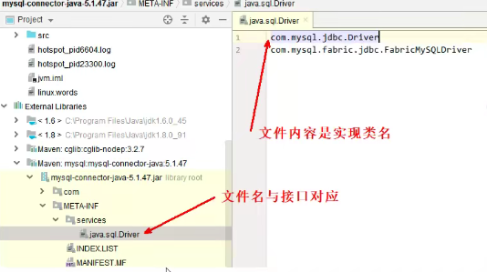

这样就可以使用

```java
ServiceLoader<接口类型> allImpls = ServiceLoader.load(接口类型.class);
Iterator<接口类型> iter = allImpls.iterator();
while(iter.hasNext()) {
    iter.next();
}
```

来得到实现类，体现的是【面向接口编程+解耦】的思想，在下面一些框架中都运用了此思想：

- JDBC 
- Servlet 初始化器 
- Spring 容器 
- Dubbo（对 SPI 进行了扩展）

接着看 ServiceLoader.load 方法：

```java
public static <S> ServiceLoader<S> load(Class<S> service) {
    // 获取线程上下文类加载器
    ClassLoader cl = Thread.currentThread().getContextClassLoader();
    return ServiceLoader.load(service, cl);
}
```

线程上下文类加载器是当前线程使用的类加载器，默认就是应用程序类加载器，它内部又是由 Class.forName 调用了线程上下文类加载器完成类加载，具体代码在 ServiceLoader 的内部类 LazyIterator 中：

```java
private S nextService() {
    if (!hasNextService())
        throw new NoSuchElementException();
    String cn = nextName;
    nextName = null;
    Class<?> c = null;
    try {
        c = Class.forName(cn, false, loader);
    } catch (ClassNotFoundException x) {
        fail(service,"Provider " + cn + " not found");
    }
    if (!service.isAssignableFrom(c)) {
        fail(service,
             "Provider " + cn + " not a subtype");
    }
    try {
        S p = service.cast(c.newInstance());
        providers.put(cn, p);
        return p;
    } catch (Throwable x) {
        fail(service,
             "Provider " + cn + " could not be instantiated",
             x);
    }
    throw new Error(); // This cannot happen
}
```


#### 5.5 自定义类加载器

什么时候需要自定义类加载器 

- 1）想加载非 classpath 随意路径中的类文件 
- 2）都是通过接口来使用实现，希望解耦时，常用在框架设计 
- 3）这些类希望予以隔离，不同应用的同名类都可以加载，不冲突，常见于 tomcat 容器

步骤：

1. 继承 ClassLoader 父类 
2. 要遵从双亲委派机制，重写 findClass 方法 
   - 注意不是重写 loadClass 方法，否则不会走双亲委派机制 
3. 读取类文件的字节码 
4. 调用父类的 defineClass 方法来加载类 
5. 使用者调用该类加载器的 loadClass 方法

示例：

```java
public class Demo3_4 {

    public static void main(String[] args) throws ClassNotFoundException, InstantiationException, IllegalAccessException {
        MyClassLoader classLoader = new MyClassLoader();
        Class<?> test = classLoader.loadClass("Test");

        System.out.println(test.newInstance());
    }
}

class MyClassLoader extends ClassLoader {

    // name为类的名称
    @Override
    protected Class<?> findClass(String name) throws ClassNotFoundException {
        String path = "D:\\org\\lql\\t3\\" + name + ".class";


        ByteArrayOutputStream os = new ByteArrayOutputStream();
        try {
            Files.copy(Paths.get(path), os);

            // 得到字节数组
            byte[] bytes = os.toByteArray();

            // byte[] -> *.class
            return defineClass(name, bytes, 0, bytes.length);
        } catch (IOException e) {
            e.printStackTrace();

            throw new ClassNotFoundException("未找到此类", e);
        }
    }
}
```


### 6. 运行期优化

#### 6.1 即时编译

##### **分层编译（TieredCompilation）**

例子

```java
public class Demo3_5 {

    public static void main(String[] args) {

        for (int i = 0; i < 200; i++) {
            long start = System.nanoTime();
            for (int j = 0; j < 1000; j++) {
                new Object();
            }
            long end = System.nanoTime();

            System.out.printf("%d\t%d\n",i,(end - start));
        }
    }
}
```

```
0	33800
1	25400
2	23100
3	23000
4	22700
5	21200
6	22000
7	22500
8	21600
9	21200
10	21200
11	23400
12	21300
13	20000
14	21400
15	21200
16	21200
17	19800
18	21200
19	21400
20	21400
21	20000
22	21200
23	21100
24	21200
25	21000
26	21100
27	21100
28	21200
29	23500
30	22800
31	24200
32	26800
33	29300
34	21100
35	21100
36	21300
37	21100
38	21100
39	21500
40	22700
41	22200
42	21400
43	21600
44	20200
45	21400
46	20800
47	21000
48	21100
49	19700
50	21000
51	21100
52	20800
53	19800
54	21000
55	21000
56	20800
57	19700
58	21000
59	20800
60	24200
61	20600
62	36400
63	23800
64	13100
65	8600
66	8700
67	8700
68	8900
69	9800
70	8800
71	8600
72	10200
73	8600
74	8700
75	8600
76	8500
77	10400
78	8800
79	8800
80	8500
81	8500
82	12100
83	8600
84	10200
85	9600
86	9900
87	10100
88	8400
89	10400
90	8500
91	8600
92	8500
93	10900
94	12700
95	10000
96	11400
97	11800
98	8700
99	8700
100	7200
101	15100
102	8800
103	8600
104	7300
105	8500
106	8700
107	8600
108	7200
109	10000
110	9300
111	10500
112	9000
113	7400
114	8700
115	11100
116	8600
117	9300
118	10000
119	8700
120	8700
121	7400
122	10600
123	8500
124	8500
125	8000
126	11300
127	9300
128	8500
129	7400
130	8800
131	8900
132	8600
133	7800
134	10600
135	10800
136	12100
137	8500
138	8700
139	11700
140	10200
141	11500
142	54800
143	21900
144	300
145	300
146	400
147	300
148	300
149	300
150	300
151	300
152	300
153	300
154	300
155	400
156	300
157	300
158	300
159	300
160	300
161	300
162	300
163	300
164	300
165	300
166	300
167	300
168	300
169	300
170	300
171	300
172	400
173	300
174	300
175	300
176	300
177	400
178	300
179	300
180	300
181	300
182	300
183	400
184	300
185	400
186	300
187	300
188	300
189	300
190	300
191	300
192	400
193	400
194	300
195	300
196	300
197	300
198	300
199	300
```

原因是什么呢？ 

JVM 将执行状态分成了 5 个层次： 

- 0 层，解释执行（Interpreter） 
- 1 层，使用 C1 即时编译器编译执行（不带 profiling） 
- 2 层，使用 C1 即时编译器编译执行（带基本的 profiling） 
- 3 层，使用 C1 即时编译器编译执行（带完全的 profiling） 
- 4 层，使用 C2 即时编译器编译执行

> profiling 是指在运行过程中收集一些程序执行状态的数据，例如【方法的调用次数】，【循环的 回边次数】等

即时编译器（JIT）与解释器的区别 

- 解释器是将字节码解释为机器码，下次即使遇到相同的字节码，仍会执行重复的解释 
- JIT 是将一些字节码编译为机器码，并存入 Code Cache，下次遇到相同的代码，直接执行，无需再编译 
- 解释器是将字节码解释为针对所有平台都通用的机器码 
- JIT 会根据平台类型，生成平台特定的机器码

对于占据大部分的不常用的代码，我们无需耗费时间将其编译成机器码，而是采取解释执行的方式运 行；另一方面，对于仅占据小部分的热点代码，我们则可以将其编译成机器码，以达到理想的运行速度。 执行效率上简单比较一下 Interpreter < C1 < C2，总的目标是发现热点代码（hotspot名称的由来），优化之

刚才的一种优化手段称之为【逃逸分析】，发现新建的对象是否逃逸。可以使用 -XX:- DoEscapeAnalysis 关闭逃逸分析，再运行刚才的示例观察结果

##### **方法内联（Inlining）**

```java
private static int square(final int i) {
    return i * i;
}
```

`System.out.println(square(9));`

如果发现 square 是热点方法，并且长度不太长时，会进行内联，所谓的内联就是把方法内代码拷贝、 粘贴到调用者的位置：

`System.out.println(9 * 9);`

还能够进行常量折叠（constant folding）的优化

`System.out.println(81);`

实验：

```java
public class JIT2 {
    // -XX:+UnlockDiagnosticVMOptions -XX:+PrintInlining （解锁隐藏参数）打印
    inlining 信息
        // -XX:CompileCommand=dontinline,*JIT2.square 禁止某个方法 inlining
        // -XX:+PrintCompilation 打印编译信息
        public static void main(String[] args) {
        int x = 0;
        for (int i = 0; i < 500; i++) {
            long start = System.nanoTime();
            for (int j = 0; j < 1000; j++) {
                x = square(9);
            }
            long end = System.nanoTime();
            System.out.printf("%d\t%d\t%d\n",i,x,(end - start));
        }
    }
    private static int square(final int i) {
        return i * i;
    }
}
```

##### **字段优化**

JMH 基准测试请参考：http://openjdk.java.net/projects/code-tools/jmh/

创建 maven 工程，添加依赖如下

```xml
<dependency>
    <groupId>org.openjdk.jmh</groupId>
    <artifactId>jmh-core</artifactId>
    <version>${jmh.version}</version>
</dependency>
<dependency>
    <groupId>org.openjdk.jmh</groupId>
    <artifactId>jmh-generator-annprocess</artifactId>
    <version>${jmh.version}</version>
    <scope>provided</scope>
</dependency>
```

编写基准测试代码：

```java
@Warmup(iterations = 2, time = 1)
@Measurement(iterations = 5, time = 1)
@State(Scope.Benchmark)
public class Demo3_6 {
    int[] elements = randomInts(1_000);

    private static int[] randomInts(int size) {
        Random random = ThreadLocalRandom.current();
        int[] values = new int[size];
        for (int i = 0; i < size; i++) {
            values[i] = random.nextInt();
        }
        return values;
    }

    @Benchmark
    public void test1() {
        for (int i = 0; i < elements.length; i++) {
            doSum(elements[i]);
        }
    }

    @Benchmark
    public void test2() {
        int[] local = this.elements;
        for (int i = 0; i < local.length; i++) {
            doSum(local[i]);
        }
    }

    @Benchmark
    public void test3() {
        for (int element : elements) {
            doSum(element);
        }
    }

    static int sum = 0;

    @CompilerControl(CompilerControl.Mode.INLINE)
    static void doSum(int x) {
        sum += x;
    }

    public static void main(String[] args) throws RunnerException {
        Options opt = new OptionsBuilder()
                .include(Demo3_6.class.getSimpleName())
                .forks(1)
                .build();
        new Runner(opt).run();
    }
}
```

首先启用 doSum 的方法内联，测试结果如下（每秒吞吐量，分数越高的更好）：

```
Benchmark       Mode  Cnt        Score       Error  Units
Demo3_6.test1  thrpt    5  3662227.082 ± 76944.189  ops/s
Demo3_6.test2  thrpt    5  3699895.276 ± 43727.442  ops/s
Demo3_6.test3  thrpt    5  3691072.488 ± 52098.309  ops/s
```

接下来禁用 doSum 方法内联

```java
@CompilerControl(CompilerControl.Mode.DONT_INLINE)
static void doSum(int x) {
    sum += x;
}
```

测试结果如下：

```
Benchmark       Mode  Cnt       Score       Error  Units
Demo3_6.test1  thrpt    5  460245.382 ± 18740.626  ops/s
Demo3_6.test2  thrpt    5  577050.009 ±  4006.288  ops/s
Demo3_6.test3  thrpt    5  576465.152 ± 12533.501  ops/s
```

分析：

示例中，doSum 方法是否内联会影响 elements 成员变量读取的优化：

如果 doSum 方法内联了，刚才的 test1 方法会被优化成下面的样子（伪代码）：

```java
@Benchmark
public void test1() {
    // elements.length 首次读取会缓存起来 -> int[] local
    for (int i = 0; i < elements.length; i++) { // 后续 999 次 求长度 <- local
        sum += elements[i]; // 1000 次取下标 i 的元素 <- local
    }
}
```

可以节省 1999 次 Field 读取操作

但如果 doSum 方法没有内联，则不会进行上面的优化


#### 6.2 反射优化

```java
import java.io.IOException;
import java.lang.reflect.InvocationTargetException;
import java.lang.reflect.Method;
public class Reflect1 {
    public static void foo() {
        System.out.println("foo...");
    }
    public static void main(String[] args) throws Exception {
        Method foo = Reflect1.class.getMethod("foo");
        for (int i = 0; i <= 16; i++) {
            System.out.printf("%d\t", i);
            foo.invoke(null);
        }
        System.in.read();
    }
}
```

foo.invoke 前面 0 ~ 15 次调用使用的是 MethodAccessor 的 NativeMethodAccessorImpl 实现

```java
package sun.reflect;
import java.lang.reflect.InvocationTargetException;
import java.lang.reflect.Method;
import sun.reflect.misc.ReflectUtil;
class NativeMethodAccessorImpl extends MethodAccessorImpl {
    private final Method method;
    private DelegatingMethodAccessorImpl parent;
    private int numInvocations;
    NativeMethodAccessorImpl(Method method) {
        this.method = method;
    }
    public Object invoke(Object target, Object[] args)
        throws IllegalArgumentException, InvocationTargetException {
        // inflationThreshold 膨胀阈值，默认 15
        if (++this.numInvocations > ReflectionFactory.inflationThreshold()
            && !ReflectUtil.isVMAnonymousClass(this.method.getDeclaringClass()))
        {
            // 使用 ASM 动态生成的新实现代替本地实现，速度较本地实现快 20 倍左右
            MethodAccessorImpl generatedMethodAccessor =
                (MethodAccessorImpl)
                (new MethodAccessorGenerator())
                .generateMethod(
                this.method.getDeclaringClass(),
                this.method.getName(),
                this.method.getParameterTypes(),
                this.method.getReturnType(),
                this.method.getExceptionTypes(),
                this.method.getModifiers()
            );
            this.parent.setDelegate(generatedMethodAccessor);
        }
        // 调用本地实现
        return invoke0(this.method, target, args);
    }
    void setParent(DelegatingMethodAccessorImpl parent) {
        this.parent = parent;
    }
    private static native Object invoke0(Method method, Object target, Object[]
                                         args);
}
```

当调用到第 16 次（从0开始算）时，会采用运行时生成的类代替掉最初的实现，可以通过 debug 得到 类名为 sun.reflect.GeneratedMethodAccessor1

可以使用阿里的 arthas 工具：

```
java -jar arthas-boot.jar
[INFO] arthas-boot version: 3.1.1
[INFO] Found existing java process, please choose one and hit RETURN.
* [1]: 13065 cn.itcast.jvm.t3.reflect.Reflect1
```

选择 1 回车表示分析该进程

```
1
[INFO] arthas home: /root/.arthas/lib/3.1.1/arthas
[INFO] Try to attach process 13065
[INFO] Attach process 13065 success.
[INFO] arthas-client connect 127.0.0.1 3658
,---. ,------. ,--------.,--. ,--. ,---. ,---.
/ O \ | .--. ''--. .--'| '--' | / O \ ' .-'
| .-. || '--'.' | | | .--. || .-. |`. `-.
| | | || |\ \ | | | | | || | | |.-' |
`--' `--'`--' '--' `--' `--' `--'`--' `--'`-----'
wiki		https://alibaba.github.io/arthas
tutorials	 https://alibaba.github.io/arthas/arthas-tutorials
version		 3.1.1
pid 		 13065
time 		 2019-06-10 12:23:54
```

再输入【jad + 类名】来进行反编译

```java
$ jad sun.reflect.GeneratedMethodAccessor1
ClassLoader:
+-sun.reflect.DelegatingClassLoader@15db9742
	+-sun.misc.Launcher$AppClassLoader@4e0e2f2a
	+-sun.misc.Launcher$ExtClassLoader@2fdb006e
Location:
/*
* Decompiled with CFR 0_132.
*
* Could not load the following classes:
* cn.itcast.jvm.t3.reflect.Reflect1
*/
package sun.reflect;
import cn.itcast.jvm.t3.reflect.Reflect1;
import java.lang.reflect.InvocationTargetException;
import sun.reflect.MethodAccessorImpl;
public class GeneratedMethodAccessor1
    extends MethodAccessorImpl {
    /*
* Loose catch block
* Enabled aggressive block sorting
* Enabled unnecessary exception pruning
* Enabled aggressive exception aggregation
* Lifted jumps to return sites
*/
    public Object invoke(Object object, Object[] arrobject) throws
        InvocationTargetException {
        // 比较奇葩的做法，如果有参数，那么抛非法参数异常
        block4 : {
            if (arrobject == null || arrobject.length == 0) break block4;
            throw new IllegalArgumentException();
        }
        try {
            // 可以看到，已经是直接调用了
            Reflect1.foo();
            // 因为没有返回值
            return null;
        }
        catch (Throwable throwable) {
            throw new InvocationTargetException(throwable);
        }
        catch (ClassCastException | NullPointerException runtimeException) {
            throw new IllegalArgumentException(Object.super.toString());
        }
    }
}
Affect(row-cnt:1) cost in 1540 ms.
```

>注意
>
>通过查看 ReflectionFactory 源码可知
>
>- sun.reflect.noInflation 可以用来禁用膨胀（直接生成 GeneratedMethodAccessor1，但首次生成比较耗时，如果仅反射调用一次，不划算）
>- sun.reflect.inflationThreshold 可以修改膨胀阈值